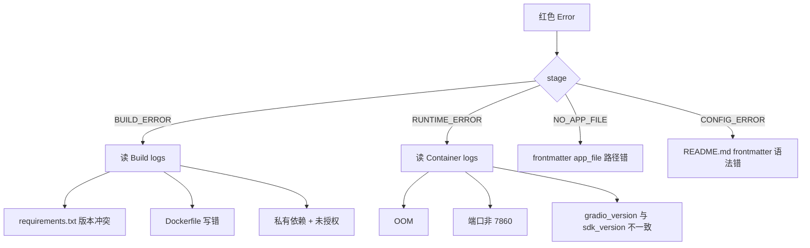

> 在 Spaces 列表里你能看到每张卡片右上角一颗圆点：🟢 Running / 🟡 Building / 🔵 Sleeping / 🔴 Error / ⚪ Stopped。它们告诉你「现在能不能点进去试」。

## 0. 定位

本节解释 6 种运行状态、它们的 API 等价值、唤醒策略与故障排查动线。

## 1. 状态全表

|颜色|状态名|API runtime.stage|能否点击试用|含义|
|---|---|---|---|---|
|🟢 绿|Running|RUNNING|✅|容器活着，请求会被处理|
|🟡 黄|Building|BUILDING / RUNNING_BUILDING|❌（等几分钟）|正在构建镜像|
|🟡 黄|App starting|APP_STARTING|❌|镜像就绪、进程启动中|
|🔵 蓝|Sleeping|SLEEPING|✅（自动唤醒）|免费 CPU Space 闲置 48h 后入眠；首请求触发唤醒|
|⚪ 灰|Stopped / Paused|STOPPED / PAUSED|❌|作者主动暂停或欠费|
|🔴 红|Build failed / Runtime error|BUILD_ERROR / RUNTIME_ERROR / NO_APP_FILE / CONFIG_ERROR|❌|看作者 logs|

## 2. 用 API 查

```python
from huggingface_hub import HfApi
rt = HfApi().get_space_runtime("<user>/<space>")
print(rt.stage, rt.hardware.current, rt.sdk_version)
```

## 3. 唤醒一个 Sleeping Space

CPU basic / ZeroGPU Space 闲置 48 小时（免费层）或 7 天（Pro 层）后会自动 sleep。**任何 HTTP 请求**都会触发唤醒（包括 curl）：

```bash
curl -s -o /dev/null -w "%{http_code}\n" https://hf.space/embed/<user>/<space>/+/
# 返回 200 表示已唤醒
```

冷启动时间：

- CPU basic：30–60 秒（重启进程）

- T4 small：1–3 分钟（重新拉镜像）

- A10G+：2–5 分钟

## 4. 不让 Space 进入 Sleep

```python
HfApi().set_space_sleep_time("<user>/<space>", sleep_time=-1)
# -1 表示永不入眠（仅付费硬件可用）
```

## 5. 故障状态排查动线



## 6. 拉日志

Web UI：Space → Logs。CLI：

```bash
huggingface-cli space logs <user>/<space> --type build  # build 阶段
huggingface-cli space logs <user>/<space> --type run    # 运行阶段
```

## 7. 工作流：fork → fix → 重启

```bash
git clone https://huggingface.co/spaces/<user>/<space>
cd <space>
# 修 requirements.txt
git commit -am "fix deps"
git push
# 推送后自动触发 rebuild，颜色 🟡 → 🟢
```

## 8. 「Restart Space」按钮

Space → Settings → Restart Space。等价 API：

```python
HfApi().restart_space("<user>/<space>")
HfApi().restart_space("<user>/<space>", factory_reboot=True)  # 重新构建镜像
```

## 参考文献

- Spaces runtime：[https://huggingface.co/docs/hub/spaces-overview#manage-your-space-with-the-hf-api](https://huggingface.co/docs/hub/spaces-overview#manage-your-space-with-the-hf-api)

- Logs：[https://huggingface.co/docs/hub/spaces-overview#logs](https://huggingface.co/docs/hub/spaces-overview#logs)