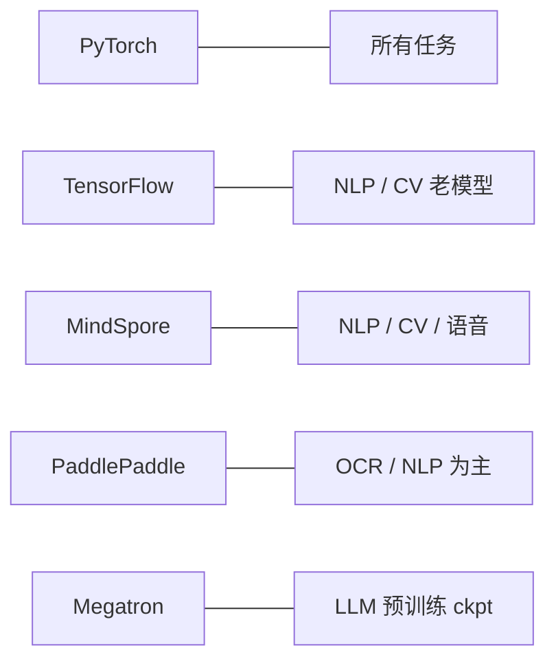

> ModelScope 仓库概述区右侧的「推理框架」胶囊列表：PyTorch / TensorFlow / MindSpore / PaddlePaddle / Megatron-LM。这决定你能用 ModelScope SDK 哪个 `Model` 封装加载它。

## 0. 定位

本节讲清 5 个推理框架徽标的含义、依赖安装、SDK 加载代码、与 HF 的距离。

## 1. 框架徽标全表

|徽标|含义|需要的 pip 包|加载示例|
|---|---|---|---|
|PyTorch|默认 · 在社区主流|`torch>=2.0`|`Model.from_pretrained(...)` 走 `pytorch` backend|
|TensorFlow|少数早期模型|`tensorflow>=2.10`|`Model.from_pretrained(model_id, framework="tensorflow")`|
|MindSpore|华为昆仑 / Atlas 原生|`mindspore>=2.2`|`Model.from_pretrained(..., framework="mindspore")`|
|PaddlePaddle|百度生态（多为 OCR / NLP 领域）|`paddlepaddle-gpu>=2.6`|需 `paddlenlp` / `paddleocr` 配套|
|Megatron-LM|超大 LLM 预训练 checkpoint|`megatron-core` 源码|用 megatron-deepspeed 脚本加载|

## 2. PyTorch + ModelScope 完整例

```python
from modelscope import Model, Tasks
from modelscope.pipelines import pipeline

p = pipeline(Tasks.text_generation,
             model="qwen/Qwen2.5-7B-Instruct")
print(p("中国的首都是\uff1f"))
```

## 3. MindSpore 例

```python
import os
os.environ["DEVICE_TARGET"] = "Ascend"   # 或 GPU/CPU

from modelscope import Model
m = Model.from_pretrained("AI-ModelScope/bert-base-chinese",
                           framework="mindspore")
```

适用场景：华为 Atlas / 昆仑平台本地 NPU。

## 4. PaddlePaddle 例

```python
from modelscope import snapshot_download
path = snapshot_download("damo/nlp_ernie_text-classification")

# 使用 PaddleNLP加载
from paddlenlp.transformers import AutoModelForSequenceClassification
m = AutoModelForSequenceClassification.from_pretrained(path)
```

## 5. 框架 × 任务兼容矩阵



## 6. 跨框架转换

同一个模型“双框架”能用 ModelScope 的 `Exporter` 输出 ONNX/TorchScript：

```python
from modelscope.exporters import Exporter
Exporter.from_model(model).export_onnx(output_dir="./onnx")
```

## 7. 与 HF 的差异

- HF 几乎只走 PyTorch + TF + JAX；MindSpore / Paddle 不是主流。

- ModelScope 以 PyTorch 为主但保留**全框架**接口，以服务中国社区。

- 拼接社区生态时，HF 上的 PaddleOCR 模型多为镜像，原版在 ModelScope。

## 参考文献

- modelscope frameworks 架构：[https://github.com/modelscope/modelscope/blob/master/modelscope/models/base/base_model.py](https://github.com/modelscope/modelscope/blob/master/modelscope/models/base/base_model.py)

- MindSpore：[https://www.mindspore.cn/](https://www.mindspore.cn/)

- PaddleNLP：[https://github.com/PaddlePaddle/PaddleNLP](https://github.com/PaddlePaddle/PaddleNLP)