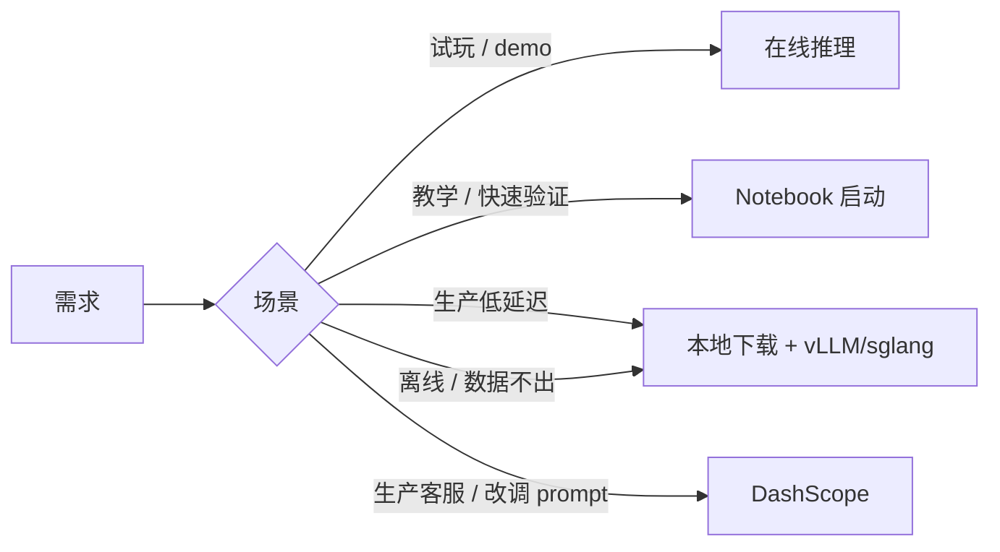

> ModelScope 独有「在线能力角标」：模型页右侧你常看到 `在线推理 · Notebook 启动 · 免费试用 · 接入 DashScope` 这几个胶囊。这些是与阿里云生态深度集成的产物。

## 0. 定位

本节讲清 4 个「不下载先试玩」入口的徽标、对应服务、计费与限制。

## 1. 能力角标全表

|胶囊|含义|费用|调用入口|
|---|---|---|---|
|在线推理|ModelScope 后台提供的 RESTful inference|大模型计量；小模型免费定额|页面 / pipelines 推理|
|Notebook 启动|云端 DSW Notebook|CPU 免费 100h/月；GPU 计时|点「快速体验」|
|免费试用|限时云 GPU 券|领取后免费|新用户礼包|
|DashScope|该模型已上架定义 SDK到阿里云 DashScope|按 token 付费|OpenAI 兼容 API|

## 2. 在线推理例

```python
import requests
r = requests.post(
    "https://www.modelscope.cn/api/v1/studio/qwen/Qwen2.5-7B-Instruct/gradio/api/predict",
    json={"data": ["中国的首都是\uff1f", 0.7, 1024]},
).json()
print(r["data"][0])
```

使用限制：

- 单账号 QPS 全限制 5；不适合生产。

- 超大模型（如 70B+）在线推理会变成「接入 DashScope」入口。

## 3. Notebook 一键启动

点击「快速体验」后，ModelScope 会在阿里云 DSW 拉一个 Jupyter，预挂载「该模型」及示例 notebook。资源选项：

- CPU 免费层：2 核 8GB。

- GPU：T4 几毛一小时。

## 4. 免费试用胶囊

多是「云资源礼包」推广。领取后：

- 资源额度：PAI-EAS / DSW / DashScope token 券。

- 有效期：通常 1–3 个月。

- 需实名认证。

## 5. DashScope 入口

一些商业型模型（Qwen-Max / Qwen3-Max / Qwen-Plus）**不提供权重下载**，只能走 DashScope API：

```python
import os
from openai import OpenAI

client = OpenAI(
    api_key=os.environ["DASHSCOPE_API_KEY"],
    base_url="https://dashscope.aliyuncs.com/compatible-mode/v1"
)
resp = client.chat.completions.create(
    model="qwen-plus",
    messages=[{"role": "user", "content": "中国的首都是\uff1f"}],
)
print(resp.choices[0].message.content)
```

## 6. 与本地下载的关系



## 7. 与 HF 的 Inference Providers 对比

- HF Inference Providers：连接到 Together / Fireworks / Replicate 等多家。

- ModelScope 在线能力：主要接入**阿里云自家生态**（DashScope / PAI-EAS / DSW）。

- 个人开发者：中国坊里，访问 DashScope 最稳；海外企业选 HF Providers。

## 参考文献

- ModelScope Studio：[https://modelscope.cn/studios](https://modelscope.cn/studios)

- DashScope：[https://help.aliyun.com/zh/model-studio](https://help.aliyun.com/zh/model-studio)

- PAI-DSW：[https://help.aliyun.com/zh/pai/user-guide/dsw](https://help.aliyun.com/zh/pai/user-guide/dsw)