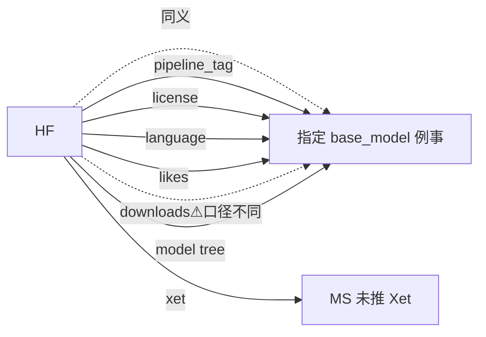

> 同一模型在 HF 上叫 `likes` `downloads` `pipeline_tag`，在 ModelScope 上叫 `喜欢` `下载` `任务`。本节以一张完整表让你在两站之间「看一眼就能翻译」。

## 0. 定位

本节是 § 9 的总结：把全部徽标在 HF / ModelScope 两站的名字、API 字段、URL 参数名全部对齐为一表。

## 1. 顶部热度 / 身份字段

|HF|ModelScope|API 字段（HF）|API 字段（MS）|口径差异|
|---|---|---|---|---|
|♥ Likes|喜欢|likes|Stars|一致（累计）|
|↓ Downloads|下载|downloads|Downloads|HF⚠️**30天**；MS是**历史累计**|
|—|评论|—|Comments|MS 独有|
|—|收藏|—|Favorites|MS 独有|
|Updated N days ago|最近更新|last_modified|GmtModified|一致|
|Trending|🔥热门|trending_score|is_hot|算法不同|
|Featured|⭐推荐|—|is_recommended|MS 人工选选|
|Xet|—|xet_hash|—|HF 独有|
|Inference Providers|在线推理|inference_providers|—|HF 跨云；MS 仅阶州云|

## 2. 任务与领域

|HF|ModelScope|URL 参数（HF）|URL 参数（MS）|
|---|---|---|---|
|pipeline_tag=text-generation|tasks=text-generation|?pipeline_tag=|?tasks=|
|pipeline_tag=automatic-speech-recognition|tasks=speech-recognition|?pipeline_tag=|?tasks=|
|pipeline_tag=image-to-text|tasks=image-captioning / ocr|?pipeline_tag=|?tasks=|
|pipeline_tag=image-text-to-text|tasks=visual-question-answering / multi-modal-embedding|?pipeline_tag=|?tasks=|
|pipeline_tag=text-to-image|tasks=text-to-image-synthesis|?pipeline_tag=|?tasks=|
|—|domain=nlp / cv / audio / multi-modal / aigc|—|?domain=|

## 3. 库 / 权重格式

|HF|ModelScope|
|---|---|
|library=transformers|framework=PyTorch|
|library=diffusers|framework=PyTorch + tag：AIGC|
|library=sentence-transformers|tag: text-embedding|
|library=gguf|tag: GGUF|
|other=AWQ / GPTQ / EXL2|tag: AWQ / GPTQ|
|library=mlx|tag: mlx|

## 4. 语言与模态

|HF|ModelScope|
|---|---|
|language=zh|language=zh （部分）或 tag：中文|
|language=en|language=en 或 tag：English|
|Modalities: Text|domain=nlp|
|Modalities: Image|domain=cv|
|Modalities: Audio|domain=audio|
|Modalities: Multimodal|domain=multi-modal|

## 5. 许可证

|HF|ModelScope|
|---|---|
|license=apache-2.0|license=apache-2.0|
|license=mit|license=mit|
|license=cc-by-nc-4.0|license=cc-by-nc-4.0|
|license=llama3.1|license=llama3.1|
|license=gemma|license=gemma|
|—|license=tongyi-qianwen|
|—|license=tongyi-qianwen-research|
|—|license=DeepSeek-License|
|—|license=Yi-License|

## 6. 访问控制

|HF|ModelScope|
|---|---|
|Public|已发布|
|Gated · auto|请求授权|
|Gated · manual|请求授权|
|Private|私有 / 可见性 ≤ 2|
|Disabled|下架 / 驳回|
|—|会员限定|

## 7. Spaces / Studios

|HF|ModelScope|
|---|---|
|Space (Gradio/Streamlit/Docker/Static)|Studio (Gradio)|
|Hardware: T4 / A10G / A100 / H100 / ZeroGPU|资源选项：CPU / T4 / V100 / A10|
|Sleeping / Running / Error|运行中 / 已关闭 / 构建中|

## 8. 一页背诵

## 参考文献

- HF model card metadata：[https://huggingface.co/docs/hub/model-cards](https://huggingface.co/docs/hub/model-cards)

- MS 模型卡说明：[https://modelscope.cn/docs/ModelCard](https://modelscope.cn/docs/ModelCard)