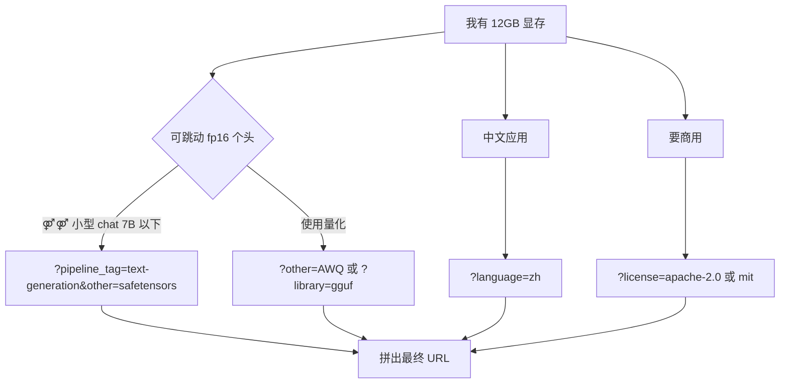

> 什么叫「按符号筛选」？就是你在需求会谈中听到「我要一个中英双语、Apache-2.0、safetensors、参数 ≤ 7B 、能商用的 chat 模型」。本节提供多组可以不动复制粘贴的 URL / API 脚本模板。

## 0. 定位

本节是 § 9 的「可复用配方集」。覆盖中文 LLM、多模态模型、embedding、中文 SFT 数据集、评测集、Space 试玩六个场景。

## 1. 场景一：中文 chat LLM（可商用、≤ 7B、safetensors）

**HF URL**：

```jsx
https://huggingface.co/models?language=zh&pipeline_tag=text-generation&license=apache-2.0&library=transformers&other=safetensors&sort=downloads
```

**HF API（AND 交集）**：

```python
from huggingface_hub import HfApi
api = HfApi()
for m in api.list_models(language="zh", pipeline_tag="text-generation",
                          library="transformers", license="apache-2.0",
                          sort="downloads", direction=-1, limit=200):
    info = api.model_info(m.modelId)
    # 过滤参数 <= 7B
    if (info.safetensors and info.safetensors.total 
        and info.safetensors.total <= 8_000_000_000):
        print(m.modelId, info.safetensors.total / 1e9, "B")
```

**MS URL**：

```jsx
https://modelscope.cn/models?domain=nlp&tasks=text-generation&license=apache-2.0&sort=Downloads
```

## 2. 场景二：中英双语 embedding（适合 RAG）

**HF**：

```jsx
https://huggingface.co/models?pipeline_tag=sentence-similarity&language=zh&language=en&sort=downloads
```

**HF API 双语 AND**：

```python
from huggingface_hub import HfApi
api = HfApi()
required = {"zh", "en"}
for m in api.list_models(language="zh", pipeline_tag="sentence-similarity",
                          sort="downloads", direction=-1, limit=100):
    info = api.model_info(m.modelId)
    if required.issubset((info.cardData or {}).get("language", []) or []):
        print(m.modelId)
```

**MS URL**：

```jsx
https://modelscope.cn/models?tasks=text-embedding&sort=Downloads
```

## 3. 场景三：多模态 VLM（能接中文 OCR）

**HF**：

```jsx
https://huggingface.co/models?pipeline_tag=image-text-to-text&language=zh&sort=downloads
```

**MS**：

```jsx
https://modelscope.cn/models?domain=multi-modal&tasks=visual-question-answering&sort=Downloads
```

## 4. 场景四：中文 SFT 数据集（>100K、可商用）

**HF**：

```jsx
https://huggingface.co/datasets?task_categories=text-generation&language=zh&license=apache-2.0&size_categories=100K<n<1M
```

**HF API**：

```python
from huggingface_hub import HfApi
for d in HfApi().list_datasets(filter="task_categories:text-generation",
                                language="zh", license="apache-2.0",
                                sort="downloads", direction=-1, limit=50):
    print(d.id, d.downloads)
```

**MS**：

```jsx
https://modelscope.cn/datasets?domain=nlp&tasks=text-generation&tags=SFT&sort=Downloads
```

## 5. 场景五：中文评测集一站取齐

**HF**：

```jsx
https://huggingface.co/datasets?other=evaluation&language=zh
```

**MS**：

```jsx
https://modelscope.cn/datasets?tags=评测
```

推荐集：C-Eval、CMMLU、AGIEval、MMLU-Pro-Zh、GSM8K-zh。

## 6. 场景六：Space 试玩某个模型但不想例明拉权重

**HF**：领 ZeroGPU 的 Space：

```jsx
https://huggingface.co/spaces?hardware=zero-a10g&sort=likes
```

或直接在模型页看 `Spaces using this model` 部分点进去。

**MS**：

```jsx
https://modelscope.cn/studios?sort=GmtCreate
```

## 7. 一键脚本：同时查两站热门

```python
#!/usr/bin/env python
import requests
from huggingface_hub import HfApi

def hf_top(pipeline_tag="text-generation", language="zh", license="apache-2.0", n=5):
    api = HfApi()
    out = []
    for m in api.list_models(pipeline_tag=pipeline_tag,
                              language=language, license=license,
                              sort="downloads", direction=-1, limit=n):
        out.append((m.modelId, m.downloads))
    return out

def ms_top(task="text-generation", license="apache-2.0", n=5):
    r = requests.post(
        "https://www.modelscope.cn/api/v1/dolphin/models",
        json={"PageSize": n, "SortBy": "Downloads",
              "Tasks": [task], "License": license,
              "Tags": ["中文"]}
    ).json()
    return [(m["Path"], m["Downloads"]) for m in r["Data"]["Model"]["Models"]]

print("HF Top:")
for mid, dl in hf_top():
    print(f"  {mid:<60} {dl}")

print("\nMS Top:")
for mid, dl in ms_top():
    print(f"  {mid:<60} {dl}")
```

## 8. 反模式：根据“我有什么”反推“我能跑什么”



## 9. 抱护：不要踩坑

- `?other=...` 与 `?library=...` 是两个字段——只能填一个 `library`，`other` 中可多个。

- HF 的 `language=zh&language=en` 是 **并集**；AND 请走 API。

- MS 的 `Tasks` 参数裁 POST body 里是数组，不能跑到 URL 里叠 N 次。

- 下载量数字不要跨站直接对比（HF 30天 vs MS 历史）。

## 参考文献

- HF list_models：[https://huggingface.co/docs/huggingface_hub/package_reference/hf_api#huggingface_hub.HfApi.list_models](https://huggingface.co/docs/huggingface_hub/package_reference/hf_api#huggingface_hub.HfApi.list_models)

- MS dolphin API（社区逆向）：[https://github.com/modelscope/modelscope/blob/master/modelscope/hub/api.py](https://github.com/modelscope/modelscope/blob/master/modelscope/hub/api.py)