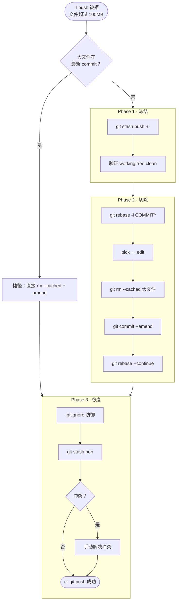

> [!important]
> 
> 本笔记梳理了在 **保留当前未提交代码**（包括新增文件和修改文件）的前提下，如何 **安全且精准** 地从 Git 历史中剔除超大文件的底层逻辑和标准操作流程。

---

## 核心应用场景

|**维度**|**描述**|
|---|---|
|**触发条件 ①**|错误地将超大文件（如 `>100MB` 的 `.pth` 权重文件）执行了 `commit`，导致无法 `push` 到远程仓库|
|**触发条件 ②**|当前工作区（Working Directory）存在尚未提交的更改（Modified）以及全新添加且未追踪的文件（Untracked）|
|**核心诉求**|在 **绝对不丢失** 当前工作区任何新代码、且 **不从物理硬盘上真实删除** 大文件的前提下，将其从 Git 历史树中彻底抹除|

---

## 全局流程总览

---

## 📖 分章阅读导航

> 以下子页按推荐阅读顺序排列，从底层原理到实操步骤再到异常处理，逐步深入。

[[1 核心底层逻辑剖析]]

[[2 Phase 1 — 绝对冻结当前工作环境]]

[[3 Phase 2 — 时光倒流与切除手术]]

[[4 Phase 3 — 防御机制建立与现场恢复]]

[[5 异常处理与最终验证推送]]