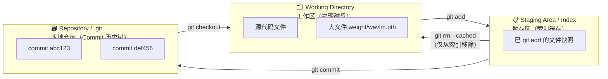
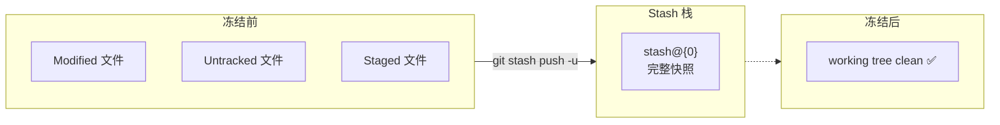
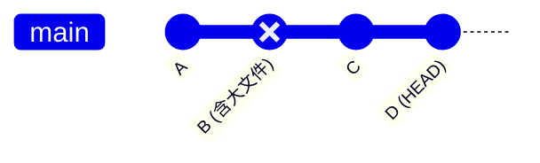
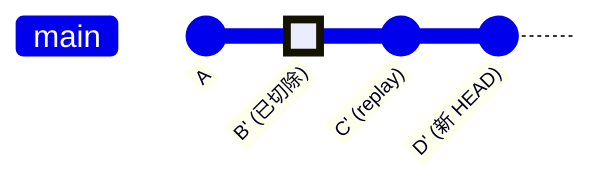
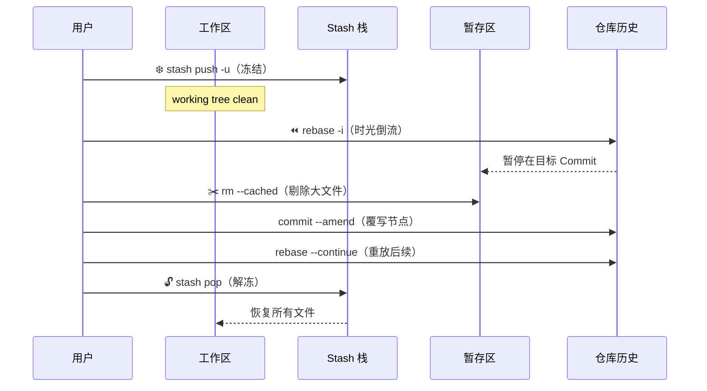

> [!important]
> 
> **前置知识：** Git 基础操作（`add` / `commit` / `push`）、对"暂存区"概念有初步认知。
> 
> **定位：** 理解整个 SOP 每一步"为什么这么做"的底层原理层。

---

## Git 三区模型回顾

整个"手术"过程的安全性建立在 Git **三区隔离模型** 之上。只有彻底理解这三个区域的边界，才能做到"精准切除、零误伤"。

|**区域**|**物理位置**|**核心职责**|**本 SOP 中的角色**|**Working Directory**|项目文件夹|你实际编辑的文件|大文件的物理载体，需要保留|
|---|---|---|---|---|---|---|---|
|**Staging Area (Index)**|`.git/index`|下一次 commit 的文件快照缓存|`git rm --cached` 的作用对象|**Repository**|`.git/objects/`|所有历史 commit 的永久存储|`rebase -i` • `amend` 的重写目标|

---

## 三大核心机制详解

### 机制一：工作区冻结 — `git stash push -u`

> [!important]
> 
> **本质：** 将工作区和暂存区的所有变动打包隔离到一个"游离于时间线之外"的临时栈中。

- Git 的变基（Rebase）操作 **要求工作区必须是干净的**

- 普通的 `git stash` 默认 **忽略未追踪文件**（Untracked）

- `**-u**` **参数至关重要**：强制将 Untracked 文件也纳入保护范围

### 机制二：指针重置与变基 — `git rebase -i`

> [!important]
> 
> **本质：** 通过交互式变基，将 `HEAD` 指针"时光倒流"悬停在引入大文件的那个历史 Commit 上，打开一个可以修改该 Commit 的编辑窗口。

**关键概念：Commit 是不可变的**

Git 中的每个 Commit 都是一个不可变的快照对象（由内容的 SHA-1 哈希唯一标识）。所谓"修改历史"实际上是：

1. 基于旧 Commit 的内容 **创建一个新的 Commit**（新 Hash）

1. 将后续所有 Commit **逐个重放（replay）** 到新主干上

1. 旧的 Commit 链成为孤儿节点，最终被 `gc` 回收

变基后：

### 机制三：暂存区剔除 — `git rm --cached`

> [!important]
> 
> **核心安全机制。** 仅将大文件从 Git 的"索引缓存（Index）"中剥离，而物理文件完好无损地保留在本地磁盘。

|**命令**|**Index 中**|**磁盘上**|**适用场景**|
|---|---|---|---|
|`git rm --cached <file>`|❌ 移除|✅ 保留|**本 SOP 的核心操作**|

随后通过 `commit --amend` 生成一个 **不包含大文件** 的全新 Commit Hash，完成"狸猫换太子"。

---

## 三大机制协作关系

> **工程判断：** 这三个机制的执行顺序不可调换。冻结必须在变基前完成（否则 rebase 拒绝执行），剔除必须在 amend 前完成（否则大文件仍存在于新 Commit 中），解冻必须在所有历史重写后执行（否则可能产生脏状态冲突）。