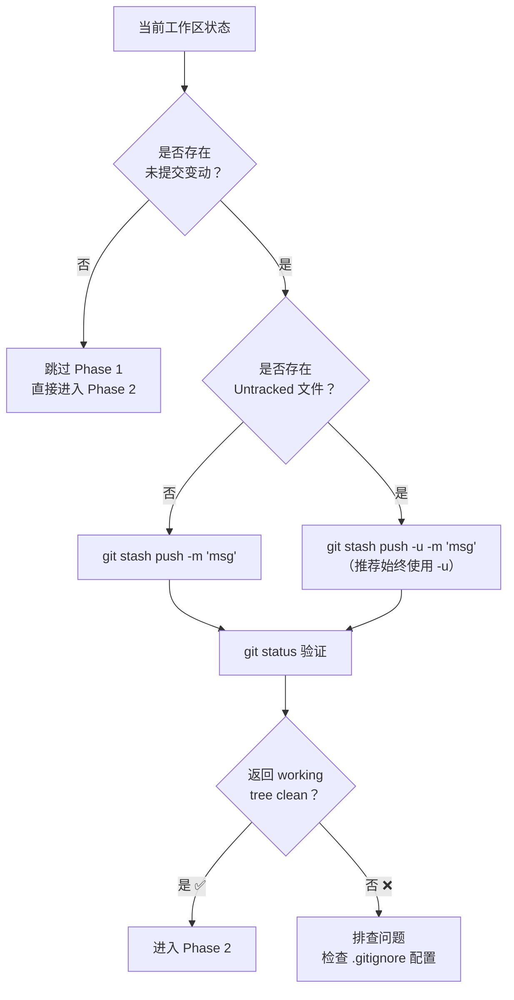

> [!important]
> 
> **前置知识：** 阅读 [[1 核心底层逻辑剖析]] 中"机制一：工作区冻结"部分。
> 
> **定位：** 保护所有未提交的心血，清空工作区以满足变基条件。

---

## 目标

在执行任何历史重写操作之前，将当前工作区中的 **所有变动**（包括 Modified、Staged、Untracked）安全转移到 Stash 栈中，确保工作区达到 `working tree clean` 状态。

---

## 操作流程



---

## 核心命令

```Bash
# -u 参数至关重要：确保新创建但未执行过 git add 的文件也被安全保护
git stash push -u -m "temp_save_before_rebase"
```

### 参数详解

|**参数**|**作用**|**是否必须**|`push`|显式推入 stash 栈（比旧语法 `git stash save` 更标准）|推荐|
|---|---|---|---|---|---|
|`-u` / `--include-untracked`|将 **Untracked 文件** 也纳入冻结范围|**⚠️ 关键**|`-m "message"`|为 stash 条目添加描述性标签，方便后续识别|推荐|

> [!important]
> 
> **常见陷阱：** 如果省略 `-u`，新建但未 `git add` 的文件将 **不会被保护**。在后续 rebase 过程中，这些文件可能会干扰操作或意外丢失。**始终使用** `**-u**` **是最安全的策略。**

---

## 验证步骤

```Bash
git status
```

**期望输出：**

```JavaScript
On branch main
nothing to commit, working tree clean
```

如果看到 `working tree clean`，说明冻结成功，可以安全进入 Phase 2。

### 可选：检查 Stash 栈内容

```Bash
# 查看 stash 列表
git stash list
# 输出示例：stash@{0}: On main: temp_save_before_rebase

# 查看 stash 详细内容（不弹出）
git stash show -p stash@{0}
```

---

## `-u` vs `-a` 参数对比

|**参数**|**覆盖范围**|**是否包含 .gitignore 忽略的文件**|**推荐度**|`-u` (--include-untracked)|Modified + Staged + Untracked|❌ 不包含|⭐⭐⭐ 推荐|
|---|---|---|---|---|---|---|---|
|`-a` (--all)|Modified + Staged + Untracked + Ignored|✅ 包含|⭐ 谨慎使用|无参数|Modified + Staged|❌ 不包含|❌ 本场景不推荐|

> **工程判断：** 本场景下 `-u` 是最佳选择。`-a` 会将被 `.gitignore` 忽略的文件（如 `node_modules/`、`__pycache__/`）也打包进 stash，会导致 stash 体积过大且恢复时可能引入不必要的文件。