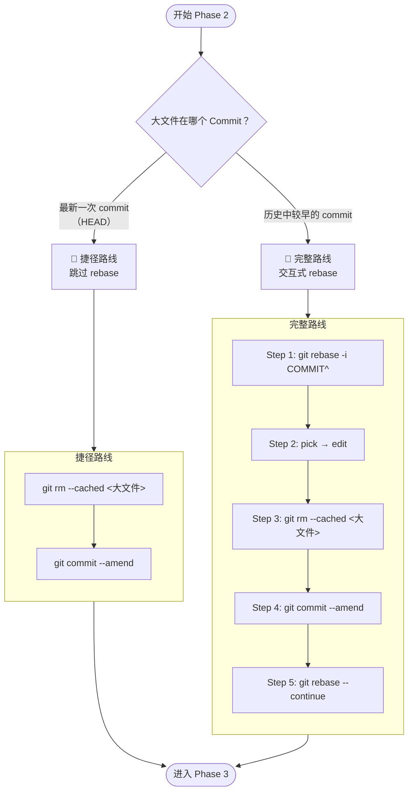
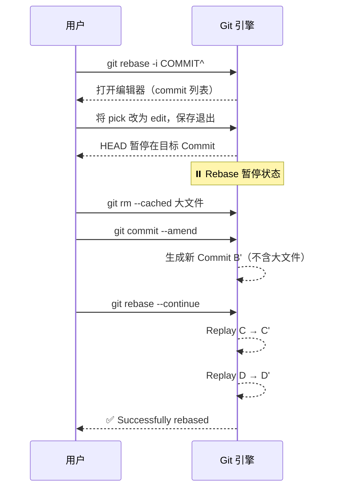

> [!important]
> 
> **前置知识：** 已完成 [[2 Phase 1 — 绝对冻结当前工作环境]]，工作区处于 `working tree clean` 状态。
> 
> **定位：** 定位并重写引入大文件的那个 Commit，从历史树中精准剔除大文件。

---

## 操作决策树

开始之前，需要先判断大文件所在的 Commit 位置：



---

## 定位目标 Commit

首先，确认大文件是被哪个 Commit 引入的：

```Bash
# 方法 1：在 log 中搜索文件名
git log --all --full-history -- "weight/wavlm_large_finetune.pth"

# 方法 2：查看最近的提交历史
git log --oneline -10

# 方法 3：查看某个 commit 包含的文件
git show --stat <CommitHash>
```

---

## 路线 A：捷径路线（大文件在最新 Commit）

当大文件恰好存在于 `HEAD`（最新一次 commit）中时，**无需 rebase**，直接原地修改即可。

```Bash
# Step 1: 从暂存区移除大文件（磁盘保留）
git rm --cached weight/wavlm_large_finetune.pth

# Step 2: 覆写最新 commit（生成新 Hash，不含大文件）
git commit --amend --no-edit
# --no-edit：沿用原 commit message，无需手动编辑
```

> [!important]
> 
> **这是最简单、最安全的路径。** 如果你的大文件就在最新 commit，优先使用此路线。

---

## 路线 B：完整路线（大文件在历史 Commit）

### Step 1：开启交互式变基

```Bash
# 注意末尾的 ^ 符号：代表回到该 commit 的前驱节点（父节点）
git rebase -i <引入大文件的CommitHash>^
```

> [!important]
> 
> `^` 必须加在 CommitHash 后面。`rebase -i` 的参数是"从哪个节点**之后**开始编辑"，所以需要指向目标 Commit 的父节点。
> 
> 实际意思你也可以直接用该节点前一个提交的 CommitHash 不用`^`
> 
> 如果你传入的是“目标提交本身的 hash”，那就需要加`^` ，因为要让 rebase 从它的父提交之后开始。
> 
> 如果你直接写目标提交的父提交 hash，就不需要加`^` 。

### Step 2：修改指令策略

Git 会弹出编辑器，显示类似内容：

```JavaScript
pick abc1234 feat: add model weights
pick def5678 fix: update config
pick ghi9012 docs: add README
```

将 **目标 commit 行**（包含大文件的那一行）的 `pick` 修改为 `edit`：

```JavaScript
edit abc1234 feat: add model weights    ← 修改这里
pick def5678 fix: update config
pick ghi9012 docs: add README
```

保存并退出编辑器（Vim: `:wq`，Nano: `Ctrl+O` → `Ctrl+X`）。

此时 Git 会将 HEAD 暂停在该 Commit 上，等待你进行修改。

### Step 3：执行无损切除

```Bash
# --cached 参数确保硬盘上的物理文件不被删除，仅从 Git 追踪树中移除
git rm --cached weight/wavlm_large_finetune.pth
```

**验证：**

```Bash
git status
# 应显示：deleted: weight/wavlm_large_finetune.pth（仅在暂存区标记为删除）
# 同时 weight/wavlm_large_finetune.pth 仍然存在于磁盘上
ls -lh weight/wavlm_large_finetune.pth   # 文件依然在
```

### Step 4：覆写历史节点

```Bash
git commit --amend
# 编辑器会弹出，可修改 commit message（建议添加说明），保存退出
# 此时会生成一个新的 Commit Hash，大文件被从该节点彻底剔除
```

### Step 5：时间轴恢复

```Bash
git rebase --continue
# Git 会自动将后续的 commits 重新应用到新的主干上
# 直至终端提示：Successfully rebased and updated refs/heads/main
```

---

## Rebase 过程中的状态变迁



---

## 常见问题速查

- rebase 过程中出现 merge conflict 怎么办？
    
    如果后续 commit 中有依赖大文件的操作（如修改了同一个路径），可能会出现冲突：
    
    ```Bash
    # 1. 查看冲突文件
    git status
    
    # 2. 手动解决冲突后
    git add <冲突文件>
    
    # 3. 继续 rebase
    git rebase --continue
    ```
    

- rebase 搞砸了怎么回退？
    
    Git 提供了安全网——`reflog`：
    
    ```Bash
    # 查看操作日志
    git reflog
    
    # 回到 rebase 之前的状态
    git reset --hard HEAD@{n}
    # 其中 n 是 reflog 中 rebase 开始前的序号
    ```
    

- 如何处理多个大文件分布在不同 Commit？
    
    可以在 `rebase -i` 的编辑器中，将 **所有包含大文件的 commit** 都标记为 `edit`，然后逐个处理。Git 会依次暂停在每个标记的 Commit 上。