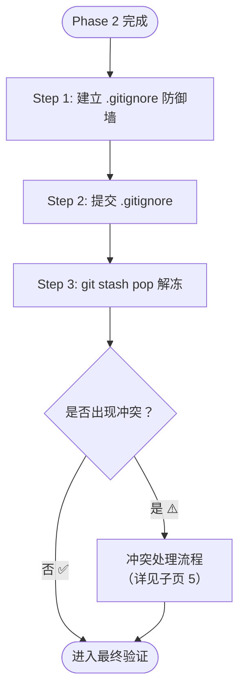

> [!important]
> 
> **前置知识：** 已完成 [[3 Phase 2 — 时光倒流与切除手术]]，大文件已从 Git 历史中剔除。
> 
> **定位：** 防止大文件未来再次被误追踪，并恢复 Phase 1 冻结的代码。

---

## 操作流程



---

## Step 1：建立 `.gitignore` 防御墙

> [!important]
> 
> **核心原则：** 先建墙，再解冻。确保大文件在 stash pop 恢复后不会被意外重新追踪。

```Bash
# 将大文件路径或通配规则追加到 .gitignore
echo "weight/*.pth" >> .gitignore
```

### `.gitignore` 规则编写指南

|**规则示例**|**含义**|**推荐场景**|`weight/wavlm.pth`|忽略特定文件|只有一个大文件需要排除|
|---|---|---|---|---|---|
|`weight/*.pth`|忽略 weight 目录下所有 `.pth` 文件|⭐ 推荐，覆盖同类文件|`**/*.pth`|忽略项目中任意位置的 `.pth` 文件|多目录存在权重文件|
|`*.onnx`|忽略所有 ONNX 模型文件|排除多种模型格式|`models/`|忽略整个 models 目录|模型文件集中存放|

**Python/ML 项目常见大文件规则模板：**

```Plain
# Model weights & checkpoints
*.pth
*.pt
*.onnx
*.bin
*.safetensors
*.ckpt

# Data files
*.h5
*.hdf5
*.parquet
*.arrow

# Compiled files
*.so
*.dylib
```

---

## Step 2：提交防御配置

```Bash
git add .gitignore
git commit -m "chore: add large files to .gitignore"
```

---

## Step 3：解冻工作区代码

```Bash
git stash pop
```

`stash pop` = `stash apply` + `stash drop`，即恢复内容并从栈中移除该条目。

### 正常情况

```Bash
# 成功输出示例：
# On branch main
# Changes not staged for commit:
#   modified:   src/train.py
#   modified:   config.yaml
# Untracked files:
#   new_script.py
# Dropped refs/stash@{0} (abc123...)
```

所有之前冻结的文件回到原来的状态，Stash 条目自动清理。✅

---

## `stash pop` vs `stash apply` 对比

|**命令**|**恢复内容**|**清理 Stash**|**冲突时行为**|
|---|---|---|---|
|`git stash apply`|✅|❌ 保留条目|恢复内容，条目不受影响|

> **工程判断：** 对安全性要求极高的场景，可以先用 `git stash apply` 确认恢复无误后，再手动执行 `git stash drop stash@{0}` 清理。这样即使恢复出问题，stash 中还有备份。