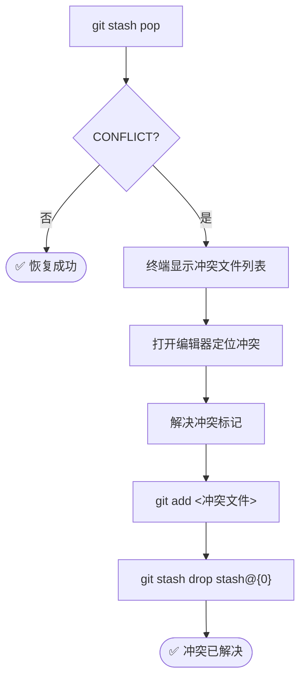

> [!important]
> 
> **前置知识：** 已完成 [[4 Phase 3 — 防御机制建立与现场恢复]]。
> 
> **定位：** 处理 stash pop 冲突、验证历史清洁度、完成最终推送。

---

## ⚠️ 异常处理：Stash Pop 冲突

### 触发条件

如果在 Phase 2 修改历史时（如提前修改了 `.gitignore`），导致其与 `stash` 中保存的旧版本文件产生冲突，`git stash pop` 会抛出冲突警告。

### 冲突处理流程



### 详细步骤

**① 识别冲突**

```Bash
git stash pop
# 输出示例：
# Auto-merging .gitignore
# CONFLICT (content): Merge conflict in .gitignore
# The stash entry is kept in case you need it again.
```

> [!important]
> 
> 注意：冲突时 `stash pop` **不会自动删除** stash 条目，以便你在解决失败时可以重试。

**② 定位并解决冲突**

打开冲突文件（如 `.gitignore`），你会看到类似内容：

```JavaScript
<<<<<<< Updated upstream
weight/*.pth
=======
# 原有的 ignore 规则
*.pyc
>>>>>>> Stashed changes
```

**推荐操作：** 在 VS Code 中点击 **Accept Both Changes**（保留双方更改），融合新旧配置。

手动合并后的结果应该是：

```Plain
weight/*.pth
# 原有的 ignore 规则
*.pyc
```

**③ 标记解决并清理**

```Bash
# 标记冲突已解决
git add .gitignore

# 手动清理 stash 条目（因为冲突时 pop 不会自动清理）
git stash drop stash@{0}
```

---

## ✅ 最终验证清单

### 验证 1：确认大文件已从历史移除

```Bash
# 搜索历史中是否还有大文件
git log --all --full-history -- "weight/wavlm_large_finetune.pth"
# 期望：无输出，或仅显示 rm 操作的记录
```

### 验证 2：确认本地文件完好

```Bash
# 大文件仍在磁盘上
ls -lh weight/wavlm_large_finetune.pth
# 期望：文件存在且大小正确

# 所有代码文件恢复正常
git status
# 期望：显示你之前的 Modified 和 Untracked 文件
```

### 验证 3：确认 `.gitignore` 生效

```Bash
# 检查大文件是否被忽略
git check-ignore -v weight/wavlm_large_finetune.pth
# 期望输出：.gitignore:1:weight/*.pth   weight/wavlm_large_finetune.pth
```

### 验证 4：推送到远程

```Bash
# 推送（如果之前已有远程历史，需要 force push）
git push -u origin <branch_name>

# 如果远程已有旧历史，必须强制推送
git push --force-with-lease origin <branch_name>
```

> [!important]
> 
> **关于** `**--force**` **vs** `**--force-with-lease**`**：**
> 
> - `--force`：无条件覆盖远程历史（**危险**）
> 
> - `--force-with-lease`：仅在远程没有被其他人更新时才覆盖（**推荐**）
> 
> - 如果是个人分支，两者效果相同；如果是协作分支，**必须用** `**--force-with-lease**` 并通知团队成员

---

## 🔧 进阶：彻底清除 Git 对象（可选）

即使从历史中移除了大文件的引用，大文件的二进制数据仍可能残留在 `.git/objects/` 中（作为悬空对象）。如果需要彻底释放磁盘空间：

```Bash
# 清除 reflog 中的旧引用
git reflog expire --expire=now --all

# 执行垃圾回收，清除孤儿对象
git gc --prune=now --aggressive

# 验证 .git 目录大小变化
du -sh .git/
```

> [!important]
> 
> **工程判断：** 对于仅需解决 push 问题的场景，这一步通常不是必需的。Git 的 gc 机制会在未来自动清理这些对象。仅在需要减小仓库体积（如 CI/CD 构建缓存优化）时执行。

---

## 📋 完整命令速查表

```Bash
# ====== Phase 1: 冻结 ======
git stash push -u -m "temp_save_before_rebase"
git status                            # 验证 clean
git log --all --full-history -- "weight/wavlm_large_finetune.pth"  # 查找目标文件所在节点

# ====== Phase 2: 切除 ======
# --- 路线 A: 大文件在 HEAD ---
git rm --cached weight/wavlm_large_finetune.pth
git commit --amend --no-edit

# --- 路线 B: 大文件在历史 ---
git rebase -i <CommitHash>^           # pick → edit
git rm --cached weight/wavlm_large_finetune.pth
git commit --amend
git rebase --continue

# ====== Phase 3: 恢复 ======
echo "weight/*.pth" >> .gitignore
git add .gitignore
git commit -m "chore: add large files to .gitignore"
git stash pop

# ====== 最终推送 ======
git push --force-with-lease origin <branch_name>
```