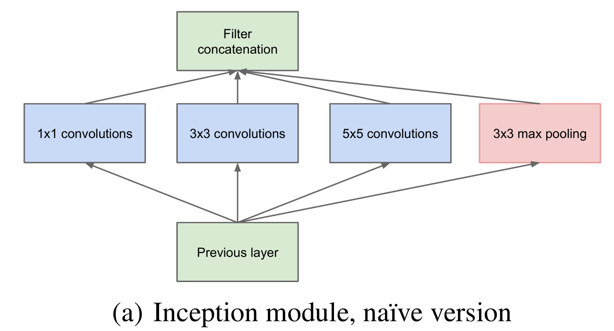
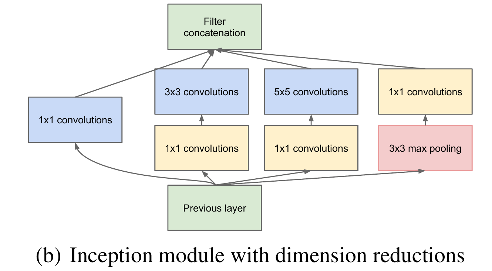
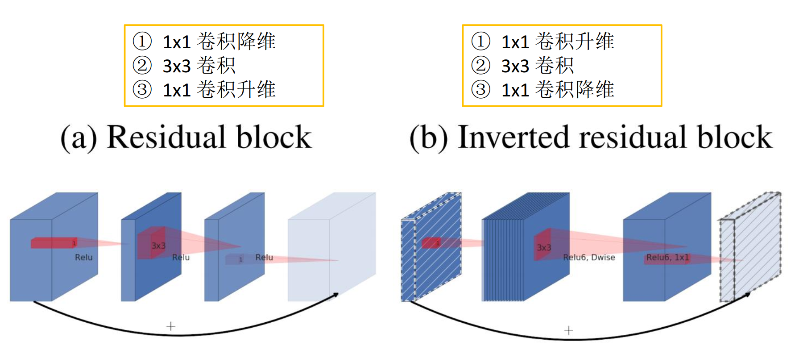
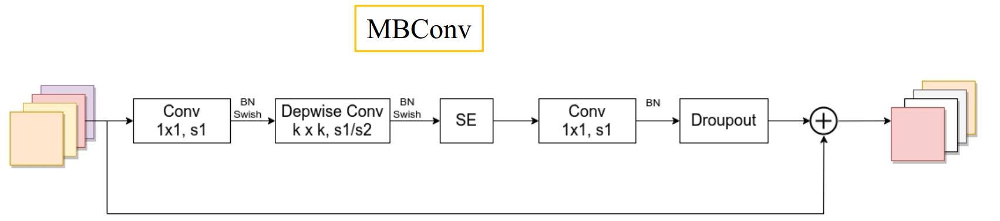
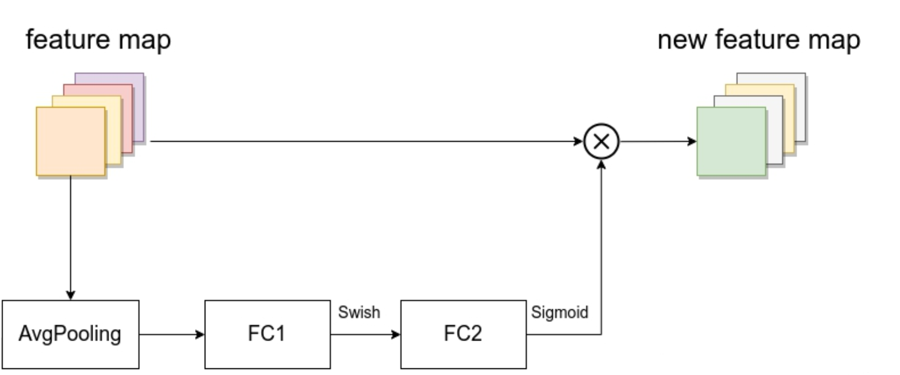
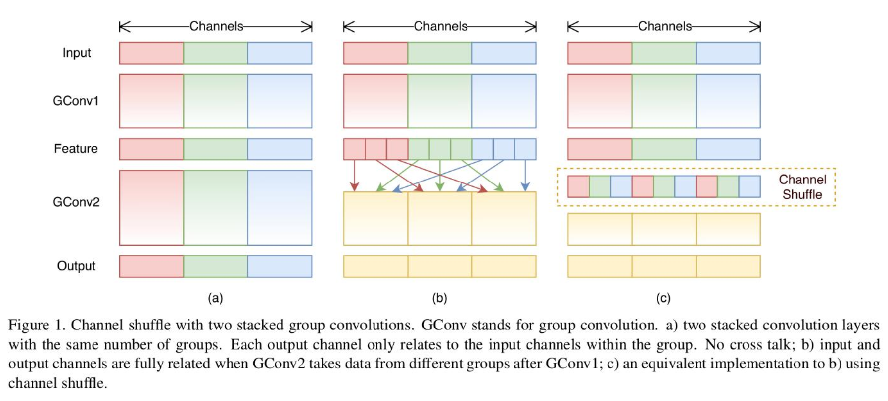

[TOC]

# 卷积结构
## Inception

**GoogLeNet**网络有时又称为Inception-v1网络，其中使用了大量的Inception模块

在VGG的最后一层， 1×1 ， 3×3 和 5×5 卷积的感受野分别是196，228，260。我们根据感受野的计算公式也可以知道，网络的层数越深，不同大小的卷积对应在原图的感受野的大小差距越大，这也就是为什么Inception通常在越深的层次中效果越明显。

Inception模块的核心思想就是将**不同大小的卷积层**通过**并联**的方式结合在一起，经过不同卷积层处理的结果矩阵在**通道**这个深度维度拼接起来，形成一个更深的矩阵。Inception模块可以反复叠堆形成更大的网络，它可以对网络的深度和宽度进行高效的扩充，在提升深度学习网络准确率的同时防止过拟合现象的发生。Inception模块的优点是可以对尺寸较大的矩阵先进行降维处理(参数少了)的同时，在不同尺寸上对视觉信息进行聚合，方便从不同尺度对特征进行提取。

Inception-v1中使用了多个1×1卷积核，其作用：

1. ​	在大小相同的感受野上叠加更多的卷积核，可以让模型学习到更加丰富的特征。传统的卷积层的输入数据只和一种尺寸的卷积核进行运算，而Inception-v1结构是Network in Network(NIN)，就是先进行一次普通的卷积运算(比如5×5)，经过激活函数(比如ReLU)输出之后，然后再进行一次1×1的卷积运算，这个后面也跟着一个激活函数。1×1的卷积操作可以理解为feature maps个神经元都进行了一个全连接运算。
2. ​        使用1×1的卷积核可以对模型进行降维，减少运算量。当一个卷积层输入了很多feature maps的时候，这个时候进行卷积运算计算量会非常大，如果先对输入进行降维操作，feature maps减少之后再进行卷积运算，运算量会大幅减少。

## 残差结构（Residual Block）

残差结构在**ResNet**提出

当模型深度增加时，模型的效果并不会变好（网络退化）

由于非线性激活函数ReLU的存在，导致输入输出不可逆，造成了模型的信息损失，更深层次的网络使用了更多的ReLU函数，导致了更多的信息损失，这使得浅层特征随着前项传播难以得到保存。

使用两个分支，一个捷径分支保留原输入的特征，一个主分支进行**降维、卷积、升维**

对于主分支：

- 通过1×1卷积核进行通道压缩减少通道数，降维操作
- 通过卷积核进行卷积处理
- 再次通过1×1卷积核进行通道扩展恢复原始通道数，升维操作

对于捷径分支：

- 一般不做处理，直接与主分支的输出进行相加操作，需要保障通道数、特征图尺寸大小均一致。
- 但是面对需要缩小特征图尺寸、加倍通道数时，也需要在此分支中添加合适卷积核

也就是说形成一个两头小中间大的瓶颈结构
## 线性瓶颈结构（Linear Bottlenecks）

与残差结构基本一致，但是最后一层卷积层的激活函数由ReLu激活函数变成了线性激活函数(也即没有激活函数)

## 倒残差结构（Inverted residual block）

在**MobileNet**中提出

与残差结构很相似，但是主分支是**先升维，再卷积，后降维**

MobileNet的倒残差结构采用DW卷积和ReLu6激活函数，即$y=\mathrm{ReLU}6(x)=\min(\max(x,0),6)$，也即仅在$[0,6]$之间有$y=x$

## MBConv结构

在**EfficientNet**网络中提出

具有深度可分离卷积的倒置线性瓶颈层

- 第一个升维的1x1卷积层卷积核个数是输入特征矩阵channel的n倍，升维为n倍，**但若n=1.0时，则没有此1×1卷积层**

- DW卷积核尺寸可以为3×3可以为5×5，步距可以为1可以为2

- SE为注意力模块

- 若没有捷径分支，则也就没有Droupout

- Swish激活函数，也即SiLU激活函数$Swish(x)=x\times Sigmoid(x)=x\times\frac{1}{1+e^{-x}}$，导数恒大于零

### SE注意力模块（SELayer）

- 由一个全局平均池化(global average pooling)， 两个全连接层组成。 
- 第一个全连接层的节点个数是**输入MBConv模块的特征矩阵**channels的**1/4**，不像MobileNet-v3针对于**SE模块的输入特征矩阵**
- 第一个激活函数，**EfficientNet中的SE模块使用Swish激活函数**。提出SE模块的论文与MobileNet-v3中均用的是ReLu激活函数
- 第二个全连接层的节点个数等于Depthwise Conv层输出的特征矩阵channels， 且使用Sigmoid激活函数。 
- 注意两个分支之间是相乘关系

## 通道重排（Channel Shuffle）

在**shuffleNet**中提出

- (a)是简单的两个**分组数相同**的分组卷积的堆叠
- (b)是GConv2**从GConv1的不同输出组中**获取数据
- (c)是经过通道重排后(b)的等价形式

