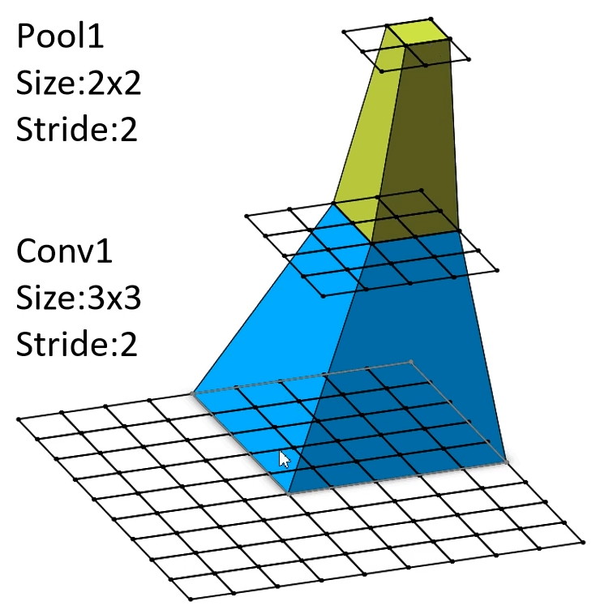

[TOC]

# CNN感受野

CNN中特征图的一个元素对应于之前某层扫过范围的子矩阵范围大小。在卷积神经网络中，feature map上某个元素的计算受输入图像上某个区域的影响，这个区域即该元素的感受野。

## **感受野反向计算公式**

$F(i)=(F(i+1)-1)\times Stride(i)+Ksize(i)$

1. $F(i)$是第$i$层的感受野
2. $Stride(i)$为第$i$层的步距
3. $Ksize(i)$为第$i$层卷积核或者池化层的尺寸

取最上层中特征图的一个元素，则有$\begin{aligned}\mathsf{Pool1:}\quad&\mathsf{F=(1-1)\times2+2=2}\\\mathsf{Conv1:}\quad&\mathsf{F=(2-1)\times2+3=5}\end{aligned}$   其中算得的$2、5$分别是池化、卷积层的感受野尺寸(方形)

---

可以使用$3$层$(3\times3)$的步距为1的卷积核可以实现一个$(7\times7)$的卷积核
$$
\begin{aligned}\mathsf{Conv3\times3(3):}\quad&\mathsf{F=(1-1)\times1+3=3}
\\\mathsf{Conv3\times3(3):}\quad&\mathsf{F=(3-1)\times1+3=5}
\\\mathsf{Conv3\times3(3):}\quad&\mathsf{F=(5-1)\times1+3=7}\end{aligned}
$$

这样可以减少参数

使用$7\times7$卷积核所需参数，与堆叠三个$3\times3$卷积核所需参数(假设输入输出channel为$C$，交叉对应所以为$C^2$)
$$
7\times7×C×C=49C^2\\\mathsf
3\times3×C×C+3\times3×C×C+3\times3×C×C=27C^2
$$

## **感受野前向计算公式**

$$
l_k=l_{k-1}+\left(\left(f_k-1\right) * \prod_{i=1}^{k-1} s_i\right)
$$
一般来说第一层感受野大小为卷积核的大小，感受野计算不考虑padding参数。

$l_k$为第$k$层的感受野大小

$f_k$为第$k$层的卷积核尺寸

$s_i$为第$i$层的步长

注意：其中对于步长的累乘只需到$k-1$层即可

举例：

| No.  | Layers | Kernel Size | Stride |
| ---- | ------ | ----------- | ------ |
| 1    | Conv1  | 3×3         | 1      |
| 2    | Pool1  | 2×2         | 2      |
| 3    | Conv2  | 3×3         | 1      |
| 4    | Pool2  | 2×2         | 2      |
| 5    | Conv3  | 3×3         | 1      |
| 6    | Conv4  | 3×3         | 1      |
| 7    | Pool3  | 2×1         | 2      |

取$l_0$为1，则有
$$
\begin{aligned}
& l_0=1 \\
& l_1=1+(3-1)=3 \\
& l_2=3+(2-1) \times 1=4 \\
& l_3=4+(3-1) \times 1 \times 2=8 \\
& l_4=8+(2-1) \times 1 \times 2 \times 1=10 \\
& l_5=10+(3-1) \times 1 \times 2 \times 1 \times 2=18 \\
& l_6=18+(3-1) \times 1 \times 2 \times 1 \times 2 \times 1=26 \\
& l_7=26+(2-1) \times 1 \times 2 \times 1 \times 2 \times 1 \times 1=30
\end{aligned}
$$
