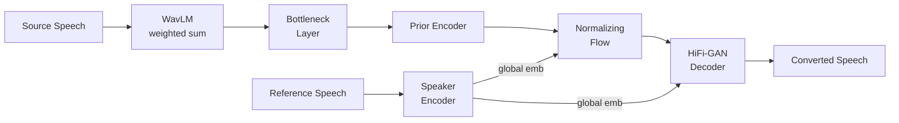

## 前置知识

> [!important]
> 
> 阅读本页前建议了解：VITS 端到端 TTS 框架、WavLM 自监督语音预训练、Normalizing Flow、信息瓶颈原理

---

## 0. 定位

> [!important]
> 
> **FreeVC**（ICASSP 2023）是较早将 SSL 自监督特征引入 VC 的代表工作，核心贡献在于证明 WavLM 特征 + 信息瓶颈可替代文本/音素输入实现高质量 one-shot VC。基于 VITS 框架改造，去除 text encoder，以 WavLM 特征直接驱动生成。在后续工作（Seed-VC、Vevo 等）中被广泛引用为 text-free VC 的里程碑。

---

## 1. 核心创新

### 1.1 WavLM 特征作为内容表征

- **加权层聚合**：可学习权重对 WavLM 多层隐特征加权求和 → 模型自动平衡语义保持与音色去除

- **线性瓶颈层**：压缩特征维度过滤残余说话人信息

> [!important]
> 
> **思辨：线性瓶颈 vs. VQ 瓶颈 vs. 数据扰动**
> 
> FreeVC 用线性投影压缩维度来滤除说话人信息，这是**最简单但最弱**的信息瓶颈。后续 [[VEVO- Controllable Zero-Shot Voice Imitation with Self-Supervised Disentanglement|VEVO]] 改用 [[02_离散视觉Token_VQVAE与dVAE|VQ-VAE]] 量化（更强的离散瓶颈），[[R-VC- Rhythm Controllable Zero-Shot Voice Conversion via Shortcut Flow Matching|R-VC]]改用数据扰动+K-means（更彻底的信号级去除）。线性瓶颈的问题在于：高维连续空间中的线性投影仍然保留了大量说话人子空间的方向信息，无法像量化那样硬截断。但它的优势是**不引入量化误差**，内容保持度最高。

### 1.2 VITS 框架改造

- 去除原始 VITS 的 text encoder → SSL 特征直接替代 phoneme 先验

- 后验编码器可选注入 WavLM 特征辅助训练

- 训练阶段自重建（同一说话人），推理阶段替换 speaker embedding

> [!important]
> 
> **误区纠正：「Text-free 意味着完全不需要文本信息」**
> 
> 不准确。FreeVC 不需要显式的文本/音素标注，但 WavLM 的预训练过程本身就编码了语言知识。Text-free 的真正含义是：**推理流程中不需要 ASR/G2P 等文本前端**，降低了 pipeline 复杂度和语言依赖性，而非说模型完全不利用语言信息。

---

## 2. 五维度定位

|维度|方案|评价|**Content 解耦**|WavLM 加权层 + 线性瓶颈|简单有效但瓶颈弱，仍有音色残留|
|---|---|---|---|---|---|
|**Timbre 建模**|全局 speaker embedding (GE2E)|零样本泛化有限|**Style 控制**|无|保留源韵律|
|**Train-Infer 一致性**|自重建训练|存在 mismatch（后续工作重点解决）|**低延迟**|VITS 单步生成|速度快，RTF << 1|

---

## 3. 历史意义与局限

**贡献**：证明了 SSL 特征 + 简单瓶颈足以实现竞争力的 text-free VC，为后续 Vevo、R-VC、Seed-VC 等工作奠定了范式基础。

**局限**：

- 线性瓶颈去音色不彻底 → 后续改为 VQ 量化或数据扰动

- 全局 speaker embedding 泛化不足 → 后续改为 ICL prompt 方式

- 自重建训练存在 mismatch → 后续引入 Timbre Shifter 或数据扰动

---

## 延伸阅读

> [!important]
> 
> 子页面（按推荐阅读顺序）：
> 
> 1. L2-1: WavLM 多层特征聚合与信息瓶颈
> 
> 1. L2-2: VITS 框架改造详解（Prior Encoder + Flow + Decoder）

## 参考文献

- [Li et al., 2022] "FreeVC: Towards High-Quality Text-Free One-Shot Voice Conversion."

- [Kim et al., 2021] "VITS: Conditional Variational Autoencoder with Adversarial Learning for End-to-End Text-to-Speech"

- [Chen et al., 2022] "WavLM: Large-Scale Self-Supervised Pre-Training for Full Stack Speech Processing"

[[L2-1- WavLM 多层特征聚合与信息瓶颈]]

[[L2-2- VITS 框架改造详解]]