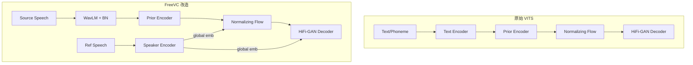

## 前置知识

> [!important]
> 
> 阅读本页前建议先读：L2-1 WavLM 多层特征聚合与信息瓶颈

---

## 0. 定位

> [!important]
> 
> 本页聚焦 FreeVC 如何改造 VITS 端到端框架，去除 text encoder 并以 WavLM 特征替代，实现 text-free one-shot VC。

---

## 1. 原始 VITS vs. FreeVC

### 关键改动

|组件|原始 VITS|FreeVC|**内容输入**|Text/Phoneme|WavLM 特征（加权聚合 + 线性瓶颈）|
|---|---|---|---|---|---|
|**Text Encoder**|Transformer encoder|❌ 去除|**Prior Encoder**|phoneme 驱动|WavLM 特征驱动|
|**Posterior Encoder**|线性频谱输入|可选注入 WavLM 特征（FreeVC-s 变体）|**Speaker 条件**|one-hot / embedding|外部 speaker encoder（GE2E）|
|**Normalizing Flow**|保留|保留（将先验分布变换为后验分布）|**HiFi-GAN Decoder**|保留|保留|

---

## 2. 训练与推理流程

**训练**（自重建）：

- 从语音 A 提取 WavLM 特征 → Prior Encoder → 先验分布

- 从语音 A 的线性频谱 → Posterior Encoder → 后验分布

- KL 散度对齐先验与后验

- Posterior 采样 → Flow → Decoder → 重建语音 A

**推理**（跨说话人）：

- 从源语音提取 WavLM 特征 → Prior Encoder → 先验分布

- 替换 speaker embedding 为目标说话人

- Prior 采样 → Flow → Decoder → 转换语音

### 1. 源说话人信息 (Source Speaker Information)

**这里的“源说话人信息”特指：WavLM 提取的特征中，未能完全剥离的、残留的“原音频音色和声学特征”。**
- **理想情况：** 我们希望 WavLM 这种自监督（SSL）特征是一个纯粹的“文本/发音内容提取器”。也就是说，无论谁说“你好”，WavLM 提取出的向量应该完全一样，只包含“ni hao”这个发音的语言学信息，不包含是谁说的。
- **现实情况（Information Leakage）：** 现有的 SSL 模型（包括 WavLM、HuBERT）做不到 100% 的特征解耦（Disentanglement）。在它们提取的高维特征中，**不可避免地夹杂了源音频说话人的音色、音高（F0）习惯、甚至录音环境的底噪**。
- **在这个语境下：** 它就是**语音 A 本身的音色**，隐式地藏在 WavLM 的特征矩阵里。

### 2. Speaker Embedding (说话人嵌入向量)

**这里的“Speaker Embedding”指：模型显式输入的、用来规定“生成出来的声音应该像谁”的条件控制向量（Conditioning Vector）。**
- **它的来源：** 它通常是由一个专门的说话人识别模型（Speaker Verification Model，例如 ECAPA-TDNN、GE2E）从参考音频中提取出来的全局向量，或者是一个在训练中学习到的可学习的参数矩阵（Speaker Look-up Table）。
- **它的作用：** 它是明确的**“音色身份牌”**。在语音转换任务中，它负责告诉解码器（Decoder/Flow）：请用这个人的音色把前面的文本内容读出来。

> [!important]
> 
> **关键局限：Train-Infer Mismatch**
> 
> 训练时自重建意味着 WavLM 特征中的源说话人信息和 speaker embedding 一致，模型可以「偷懒」。推理时两者不一致 → 音色泄漏。这正是后续 Seed-VC（Timbre Shifter）和 R-VC（数据扰动）致力解决的问题。
> 
> **源说话人信息**是输入特征中“偷偷夹带”的原声属性
> 
> **Speaker Embedding** 是我们“光明正大”给出的目标音色指令。训练时两者的目标一致，导致模型忽略了指令（Embedding），过度依赖夹带的私货（WavLM 里的残留音色），最终导致推理时无法完美切换音色。

---

## 3. VITS 单步生成的速度优势

FreeVC 继承了 VITS 的**单步生成**特性（通过 Normalizing Flow 直接映射到波形），无需多步迭代采样。相比 R-VC（NFE=2）和 Vevo（NFE=32），FreeVC 的推理速度最快（RTF << 1）。但代价是生成质量受限于 Flow 的表达能力。

---

## 延伸阅读

> [!important]
> 
> - 回到总纲：[[FreeVC- Towards High-Quality Text-Free One-Shot Voice Conversion]]

## 参考文献

- [Li et al., 2022] FreeVC 原论文

- [Kim et al., 2021] "VITS: Conditional Variational Autoencoder with Adversarial Learning for End-to-End Text-to-Speech"