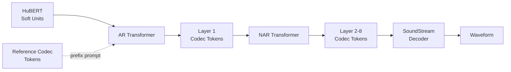
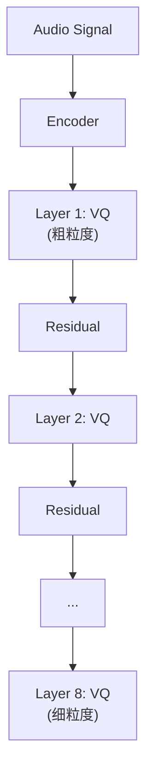

## 前置知识

> [!important]
> 
> 阅读本页前建议先读：L2-1 HuBERT Soft Units 与 Codec Token 对比

---

## 0. 定位

> [!important]
> 
> 本页聚焦 LM-VC 的生成框架：如何用 AR Transformer 预测粗粒度 codec tokens + NAR Transformer 预测细粒度 codec tokens 实现音色迁移。

---

## 1. 双阶段架构

### AR 阶段（粗粒度）

- 自回归逐 token 预测第 1 层 SoundStream codec token

- 目标说话人的 codec token 前缀作为 prompt 注入音色

- 第 1 层 token 编码基本的声学框架（音高轮廓、能量包络、粗频谱）

### NAR 阶段（细粒度）

- 非自回归并行预测第 2-8 层残差 codec tokens

- 以第 1 层 tokens 为条件

- 高层 tokens 补充声学细节（谐波结构、噪声纹理）

---

## 2. RVQ Codec 结构

SoundStream 使用**残差向量量化（RVQ）**：

每一层量化前一层的残差，逐层补充更多细节。第 1 层最重要（粗轮廓），高层提供精修。

> [!important]
> 
> **思辨：AR + NAR 分层 vs. 纯 AR vs. 纯 NAR**
> 
> - **纯 AR**（如 VALL-E 早期）：所有层顺序生成 → 极慢
> 
> - **纯 NAR**：所有层并行生成 → 快但质量差（高层依赖低层）
> 
> - **AR 第 1 层 + NAR 高层**（LM-VC / VALL-E）：平衡速度与质量
> 
> 后续工作的进化：
> 
> - **Vevo**：不用 codec，直接 AR token → FM Mel → vocoder
> 
> - **R-VC**：不用 AR，直接 NAR FM 生成 Mel → vocoder
> 
> - **趋势**：Codec token 生成范式正逐渐被 Flow Matching 直接生成 Mel 的范式替代

---

## 3. Prompt-based ICL

目标音色通过 codec token 前缀注入：

- 取参考语音的 codec tokens（所有层）

- 作为 AR/NAR 输入的 prefix

- 模型从 prefix 中学习目标音色并应用到生成

> [!important]
> 
> **工程判断：Codec prompt vs. Mel prompt ICL**
> 
> - **Codec prompt**（LM-VC）：离散 tokens，信息量有限，且 codec 质量影响音色表征
> 
> - **Mel prompt**（Seed-VC, R-VC, Vevo）：连续频谱，信息量丰富，音色保真度更高
> 
> Mel prompt ICL 在 2024 年后成为主流（SECS 普遍 > 0.85），codec prompt 方案（SECS 通常 < 0.80）逐渐被淘汰。

---

## 延伸阅读

> [!important]
> 
> 回到总纲：[[LM-VC- Zero-shot Voice Conversion via Speech Generation based on Language Models]]

## 参考文献

- [Wang et al., 2023] LM-VC 原论文 §3.2 Generation Framework

- [Wang et al., 2023] "VALL-E" — AR+NAR codec 生成的先驱

- [Zeghidour et al., 2021] "SoundStream" — RVQ codec