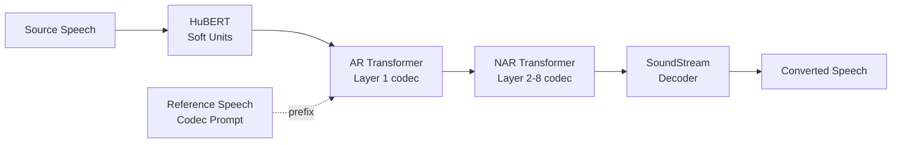

## 前置知识

> [!important]
> 
> 阅读本页前建议了解：HuBERT 自监督表征、SoundStream / EnCodec 残差向量量化、自回归语言模型、In-Context Learning

---

## 0. 定位

> [!important]
> 
> **LM-VC**（IEEE SPL 2023）是较早将**语言模型范式**引入零样本 VC 的探索性工作。核心思路是将 VC 重构为「给定内容 tokens + 音色 prompt → 预测声学 codec tokens」的条件序列生成任务，验证了 LM + in-context learning 在 VC 中的可行性。

---

## 1. 核心创新

### 1.1 VC as Language Modeling

**关键设计**：

- **AR 阶段**：自回归预测第 1 层 codec token（粗粒度声学信息），以参考语音的 codec tokens 为 prompt 前缀

- **NAR 阶段**：非自回归并行预测第 2-8 层 codec tokens（细粒度声学细节），条件为第 1 层 tokens

- **Prompt-based ICL**：目标音色通过参考语音的 codec token 前缀注入，无需额外 speaker embedding

### 1.2 Soft Units vs. Hard Tokens

> [!important]
> 
> **思辨：连续 soft units vs. 离散 K-means tokens**
> 
> - K-means 离散化丢失语言细节（WER↑），但彻底去除说话人连续变异
> 
> - Soft units 保留连续信息有利于内容保持（WER↓），但残留更多 speaker info
> 
> - LM-VC 选择 soft units 优先保证内容质量，将去音色任务交给 LM 的 prompt conditioning 来隐式完成
> 
> - 后续 R-VC 证明：离散化 + 去重 + 数据扰动可以两者兼得（WER=3.51 且音色泄漏极低）

---

## 2. 五维度定位

| 维度                  | 方案                         | 评价                        |
| ------------------- | -------------------------- | ------------------------- |
| **Timbre 建模**       | Prompt-based ICL（codec 前缀） | 早期 ICL 方案，效果受限于 prompt 长度 |
| **Train-Infer 一致性** | 自重建训练 + 跨说话人推理             | 存在 mismatch               |
| **Content 解耦**      | HuBERT soft units（连续）      | 内容保持好但音色残留多               |
| **Style 控制**        | 无显式控制                      | 保留源节奏                     |
| **低延迟**             | AR 逐 token 生成              | 序列长，速度受限                  |

---

## 3. 历史意义

**贡献**：首次系统性验证了 LM + codec + ICL 在 VC 中的可行性，为后续 VALL-E 系列的 VC 应用铺平道路。

**局限**：

- AR 生成效率低 → 后续 R-VC 用 NAR + Shortcut FM 解决

- Prompt 前缀注入音色有限 → 后续 Seed-VC 用完整参考 mel ICL 增强

- Soft units 音色残留 → 后续 Vevo 用 VQ-VAE 量化解决

---

## 延伸阅读

> [!important]
> 
> 子页面（按推荐阅读顺序）：
> 
> 1. L2-1: HuBERT Soft Units 与 Codec Token 对比
> 
> 1. L2-2: AR/NAR 双阶段 Codec 生成

## 参考文献

- [Wang et al., 2023] "LM-VC: Zero-shot Voice Conversion via Speech Generation based on Language Models." IEEE SPL.

- [Wang et al., 2023] "VALL-E: Neural Codec Language Models are Zero-Shot Text to Speech Synthesizers"

- [Hsu et al., 2021] "HuBERT: Self-Supervised Speech Representation Learning by Masked Prediction of Hidden Units"

- [Zeghidour et al., 2021] "SoundStream: An End-to-End Neural Audio Codec"

[[L2-1- HuBERT Soft Units 与 Codec Token 对比]]

[[L2-2- AR-NAR 双阶段 Codec 生成]]