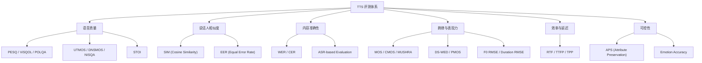

TTS 领域的评测体系涵盖**数据集/测试集**、**主观评价**、**客观指标**、**评测框架**四大维度。本页面系统梳理当前学术界与工业界主流的 Benchmark 资源，并提供端到端的评测实战指南。

---

## 评测体系总览

> [!important]
> 
> **TTS Benchmark 四维体系**
> 
> 1. **评测数据集与测试集** — 零样本克隆、多语言、长语音等场景的标准测试集
> 
> 1. **主观评价方法** — MOS / CMOS / MUSHRA / AB 测试等人工听感评测
> 
> 1. **客观评价指标** — 语音质量、说话人相似度、内容准确性、韵律多样性等自动化指标
> 
> 1. **评测框架与工具链** — 端到端的开源评测 Pipeline

---

## 内容导航

### [[论文库/Qwen3-TTS Technical Report/TTS 评测基准全景指南/1-评测数据集与测试集]]

主流 TTS 评测中使用的标准数据集，包括 Seed-TTS Eval、LibriSpeech test-clean、LJSpeech、VCTK、CommonVoice、Emilia 等，按场景分类梳理。

### [[论文库/Qwen3-TTS Technical Report/TTS 评测基准全景指南/2-主观评价方法详解]]

MOS（平均意见分）、CMOS（比较平均意见分）、MUSHRA、AB 偏好测试等主观评测的设计规范、统计方法与实施要点。

### [[3-客观评价指标体系]]

> [!important]
> 
> 已有详细页面 → [[论文库/Qwen3-TTS Technical Report/Qwen3-TTS 评价指标详解|Qwen3-TTS 评价指标详解]]
> 
> 本节在此基础上补充 **DNSMOS**、**ViSQOL**、**POLQA**、**NISQA**、**DS-WED**（韵律多样性）、**TTSDS2**（分布式评分）等新兴指标。

### [[4-评测框架与工具链]]

UltraEval-Audio、TTSDS2、Seed-TTS-Eval 脚本、ESPnet 评测模块等开源框架的架构与使用方法。

### [[论文库/Qwen3-TTS Technical Report/TTS 评测基准全景指南/5-客观评价指标体系详解]]

信号级（PESQ/STOI/ViSQOL/POLQA）、无参考（UTMOS/DNSMOS/NISQA）、说话人相似度、内容准确性、韵律表现力、效率延迟六大类指标的横向对比、适用场景与工程实现。

### [[论文库/Qwen3-TTS Technical Report/TTS 评测基准全景指南/6-语音编解码器与Tokenizer评测]]

主流 Speech Codec（SoundStream/EnCodec/DAC/Mimi/H-Codec）的 RVQ 原理、重建质量评测、语义-声学分离方案对比与帧率 Trade-off 分析。

### [[论文库/Qwen3-TTS Technical Report/TTS 评测基准全景指南/7-前沿TTS模型Benchmark横评]]

2024-2025 年 15+ 主流 TTS 模型在 Seed-TTS Eval（EN/ZH/Hard）、长语音、多语言等维度的全面横向对比，含复现资源汇总。

### [[论文库/Qwen3-TTS Technical Report/TTS 评测基准全景指南/8-多语言与跨语言TTS评测]]

CosyVoice 3（9 语言 + 18 方言）、Fish Speech V1.5、XTTS 等模型的多语言评测体系，跨语言声音克隆 SIM 矩阵、方言评测、LID 准确率等专项指标。

### [[论文库/Qwen3-TTS Technical Report/TTS 评测基准全景指南/9-可控语音生成与安全评测]]

情感/风格/语速/韵律控制的评测方法（APS、Emotion Accuracy、F0 Control），TTS Arena ELO 排名机制，深度伪造检测（ASVspoof 5）与音频水印评测。

### [[论文库/Qwen3-TTS Technical Report/TTS 评测基准全景指南/10-TTS评测前沿趋势与开放挑战]]

LLM-as-Judge、SpeechLMScore、分布级指标（TTSDS/FAD/KID）、VERSA 统一框架、QualiSpeech 质量推理，以及标准化/长语音/交互式评测等开放挑战。

### [[论文库/Qwen3-TTS Technical Report/TTS 评测基准全景指南/11-端到端评测实战流程]]

从数据准备 → 批量推理 → WER/SIM/MOS 计算 → 结果可视化的完整 Python 实战流程。

---

## 主流 Benchmark 速查表

|**Benchmark**|**发布方**|**场景**|**语言**|**核心指标**|**论文/链接**|
|---|---|---|---|---|---|
|**Seed-TTS Eval**|ByteDance|零样本 TTS/VC|EN / ZH|WER, SIM|[GitHub](https://github.com/BytedanceSpeech/seed-tts-eval)|
|**LibriSpeech test-clean**|OpenSLR|重建质量 / ASR|EN|PESQ, STOI, UTMOS, SIM|[OpenSLR](http://www.openslr.org/12/)|
|**LJSpeech**|Keith Ito|单说话人 TTS|EN|MOS, PESQ|[Link](https://keithito.com/LJ-Speech-Dataset/)|
|**VCTK**|CSTR Edinburgh|多说话人 / 克隆|EN（多口音）|SIM, MOS|[CSTR](https://datashare.ed.ac.uk/handle/10283/3443)|
|**CommonVoice**|Mozilla|多语言 ASR/TTS|100+ 语言|WER, CER|[Mozilla](https://commonvoice.mozilla.org)|
|**InstructTTSEval**|学术界|可控语音生成|EN / ZH|APS|论文内置|
|**ProsodyEval**|学术界 (2025)|韵律多样性|EN|PMOS, DS-WED|[arXiv](https://arxiv.org/abs/2509.19928)|
|**TTSDS2**|学术界 (2025)|分布式质量评估|EN|TTSDS Score|[arXiv](https://arxiv.org/abs/2506.19441)|
|**Emilia**|Amphion|多语种训练/评测|6 语言|WER, SIM, MOS|[HuggingFace](https://huggingface.co/datasets/Amphion/Emilia)|
|**UltraEval-Audio**|OpenBMB|语音理解+生成|10 语言|34 基准聚合|[GitHub](https://github.com/OpenBMB/UltraEval-Audio)|
|**QualiSpeech**|学术界 (2025)|语音质量+推理|EN|NL 描述 + MOS|论文|

---

## 评测维度与指标映射

---

## 指标分类速记

> [!important]
> 
> **信号级指标（需参考音频）**：PESQ、STOI、ViSQOL、POLQA — 直接比较合成语音与参考语音的波形/频谱差异

> [!important]
> 
> **无参考指标（不需参考音频）**：UTMOS、DNSMOS、NISQA — 基于深度学习模型预测 MOS，适合大规模自动评测

> [!important]
> 
> **主观指标（人工评测）**：MOS、CMOS、MUSHRA、AB Test — 金标准但成本高，通常用于最终发布前验证

> [!important]
> 
> **内容指标（ASR 辅助）**：WER、CER — 通过 ASR 转录合成语音再与原文比较，衡量内容忠实度

[[论文库/Qwen3-TTS Technical Report/TTS 评测基准全景指南/2-主观评价方法详解|2-主观评价方法详解]]

[[论文库/Qwen3-TTS Technical Report/TTS 评测基准全景指南/1-评测数据集与测试集|1-评测数据集与测试集]]

[[论文库/Qwen3-TTS Technical Report/TTS 评测基准全景指南/11-端到端评测实战流程|11-端到端评测实战流程]]

[[论文库/Qwen3-TTS Technical Report/TTS 评测基准全景指南/3-评测框架与工具链|3-评测框架与工具链]]

[[论文库/Qwen3-TTS Technical Report/TTS 评测基准全景指南/5-客观评价指标体系详解|5-客观评价指标体系详解]]

[[论文库/Qwen3-TTS Technical Report/TTS 评测基准全景指南/7-前沿TTS模型Benchmark横评|7-前沿TTS模型Benchmark横评]]

[[论文库/Qwen3-TTS Technical Report/TTS 评测基准全景指南/6-语音编解码器与Tokenizer评测|6-语音编解码器与Tokenizer评测]]

[[论文库/Qwen3-TTS Technical Report/TTS 评测基准全景指南/10-TTS评测前沿趋势与开放挑战|10-TTS评测前沿趋势与开放挑战]]

[[论文库/Qwen3-TTS Technical Report/TTS 评测基准全景指南/8-多语言与跨语言TTS评测|8-多语言与跨语言TTS评测]]

[[论文库/Qwen3-TTS Technical Report/TTS 评测基准全景指南/9-可控语音生成与安全评测|9-可控语音生成与安全评测]]