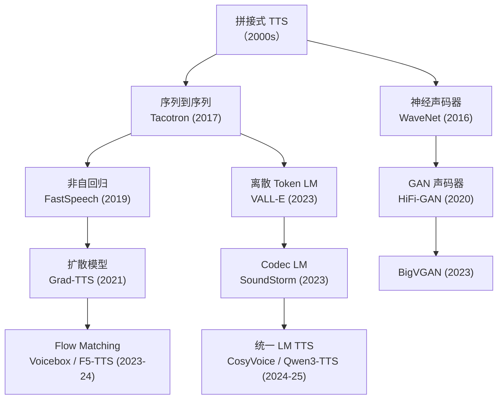

本页汇总 2024-2025 年主流 TTS 模型在标准 Benchmark 上的评测结果，覆盖开源与闭源系统，按 Seed-TTS Eval、LibriSpeech 重建、长语音、多语言等维度进行全面横向对比。

---

## 一、模型概览

|**模型**|**发布方**|**参数量**|**架构**|**开源**|**发布时间**|
|---|---|---|---|---|---|
|**Seed-TTS**|ByteDance|—|AR + Flow Matching|❌|2024.06|
|**MiniMax-Speech**|MiniMax|—|LLM-based|❌|2024.12|
|**CosyVoice 1.0**|阿里 FunAudioLLM|0.3B|LLM + Flow Matching|✅|2024.07|
|**CosyVoice 2.0**|阿里 FunAudioLLM|0.5B|LLM + Chunk-aware Flow|✅|2024.12|
|**CosyVoice 3.0**|阿里 FunAudioLLM|0.5B / 1.5B|LLM + Flow Matching|✅|2025.05|
|**F5-TTS**|SWivid|0.3B|Flow Matching (DiT)|✅|2024.10|
|**MaskGCT**|Amphion|1B|Masked Generative Codec|✅|2024.10|
|**ChatTTS**|2noise|—|GPT-style AR|✅|2024.05|
|**SparkTTS**|讯飞|0.5B|LLM-based|✅|2025.03|
|**FireRedTTS**|FireRed|0.5B|LLM + Flow|✅|2024.09|
|**MegaTTS3**|字节跳动|0.5B|DiT + Diffusion|❌|2025.02|
|**DiTAR**|学术界|0.6B|DiT AR|❌|2025.03|
|**VoxCPM**|OpenBMB|—|LLM-based|✅|2025|
|**Higgs-Audio-v2**|Boson AI|—|LLM-based|—|2025|
|**Qwen3-TTS**|阿里 Qwen|0.6B / 1.7B|LM + DiT / BigVGAN|—|2025.06|

---

## 二、Seed-TTS Eval 横评（零样本克隆）

> [!important]
> 
> **当前业界最权威的零样本 TTS 对比基准**
> 
> - **指标**：WER（内容准确性，越低越好）+ SIM（说话人相似度，越高越好）
> 
> - **ASR 后端**：EN = Whisper-large-v3 / ZH = Paraformer-zh
> 
> - **Speaker Encoder**：WavLM-TDNN

### 2.1 test-EN（英文零样本 TTS）

|**模型**|**参数**|**开源**|**WER/% ↓**|**SIM/% ↑**|
|---|---|---|---|---|
|**Qwen3-TTS-12Hz-1.7B**|1.7B|—|**1.24**|**72.1**|
|MiniMax-Speech|—|❌|1.65|69.2|
|DiTAR|0.6B|❌|1.69|73.5|
|F5-TTS|0.3B|✅|2.00|67.0|
|CosyVoice 3 (0.5B)|0.5B|✅|2.02|71.8|
|CosyVoice 3 (1.5B)|1.5B|✅|2.22|72.0|
|Seed-TTS|—|❌|2.25|76.2|
|MaskGCT|1B|✅|2.62|71.7|
|MegaTTS3|0.5B|❌|2.79|77.1|
|CosyVoice 2|0.5B|✅|3.09|65.9|
|SparkTTS|0.5B|✅|3.14|57.3|
|FireRedTTS|0.5B|✅|3.82|46.0|
|CosyVoice 1|0.3B|✅|4.29|60.9|

### 2.2 test-ZH（中文零样本 TTS）

|**模型**|**参数**|**开源**|**CER/% ↓**|**SIM/% ↑**|
|---|---|---|---|---|
|**Qwen3-TTS-12Hz-1.7B**|1.7B|—|**0.77**|**77.4**|
|MiniMax-Speech|—|❌|0.83|78.3|
|DiTAR|0.6B|❌|1.02|75.3|
|Seed-TTS|—|❌|1.12|79.6|
|CosyVoice 3 (0.5B)|0.5B|✅|1.16|78.0|
|CosyVoice 2|0.5B|✅|1.38|75.7|
|MegaTTS3|0.5B|❌|1.52|79.0|
|F5-TTS|0.3B|✅|1.53|76.0|
|SparkTTS|0.5B|✅|1.54|66.0|
|FireRedTTS|0.5B|✅|1.51|63.5|
|MaskGCT|1B|✅|2.27|77.4|
|CosyVoice 1|0.3B|✅|3.63|72.3|

### 2.3 test-Hard（中文困难样本）

|**模型**|**CER/% ↓**|**SIM/% ↑**|
|---|---|---|
|CosyVoice 3 (0.5B)|6.08|75.8|
|CosyVoice 3 (1.5B)|5.83|75.8|
|CosyVoice 2|6.83|72.4|
|Seed-TTS|7.59|77.6|
|F5-TTS|8.67|71.3|
|CosyVoice 1|11.75|70.9|
|FireRedTTS|17.45|62.1|

---

## 三、长语音评测

> [!important]
> 
> 长语音（>10 分钟）是检验 TTS 模型**鲁棒性**的核心场景。大多数模型在长语音下出现严重的重复、遗漏或韵律崩塌问题。

|**模型**|**long-zh WER ↓**|**long-en WER ↓**|
|---|---|---|
|**Qwen3-TTS-25Hz-1.7B**|**1.517**|**1.225**|
|Qwen3-TTS-12Hz-1.7B|1.847|1.386|
|Higgs-Audio-v2|5.505|6.917|
|MiniMax-Speech|3.474|2.506|
|VibeVoice|22.619|1.780|

---

## 四、TTS 模型架构演进

---

## 五、关键发现与趋势

### 5.1 WER vs SIM 的权衡

> [!important]
> 
> **核心观察**：在 Seed-TTS Eval 上，WER 和 SIM 往往存在一定的权衡关系。
> 
> - **MegaTTS3** / **Seed-TTS**：SIM 极高（77-80%）但 WER 偏高
> 
> - **Qwen3-TTS** / **MiniMax-Speech**：WER 极低（<1.65%）但 SIM 相对低
> 
> - **CosyVoice 3**：两者均衡
> 
> 这反映了模型在**内容忠实度**和**音色保真度**之间的不同取舍。

### 5.2 模型规模效应

- CosyVoice 3：0.5B → 1.5B 提升有限（WER 2.02→2.22 反而上升，SIM 71.8→72.0 微升）

- Qwen3-TTS：0.6B → 1.7B 在 WER 上显著提升，尤其是长语音场景

- **结论**：参数量对长语音鲁棒性影响更大，对短句质量影响相对有限

### 5.3 开源 vs 闭源差距

|**维度**|**开源最佳**|**闭源最佳**|**差距**|
|---|---|---|---|
|EN WER|F5-TTS (2.00)|Qwen3-TTS (1.24)|0.76pp|
|EN SIM|MaskGCT (71.7)|MegaTTS3 (77.1)|5.4pp|
|ZH CER|CosyVoice 3 (1.16)|Qwen3-TTS (0.77)|0.39pp|
|ZH SIM|MaskGCT (77.4)|Seed-TTS (79.6)|2.2pp|

### 5.4 架构趋势

1. **LM-based 成为主流**：CosyVoice、Qwen3-TTS、SparkTTS 等均采用 LLM 作为 TTS 骨干

1. **Flow Matching 替代 Diffusion**：更快的采样速度和更好的质量（F5-TTS、CosyVoice 3）

1. **更低帧率 Tokenizer**：从 75Hz（EnCodec）→ 12Hz（Qwen3-TTS），序列长度压缩 6 倍

1. **端到端可控生成**：通过自然语言指令控制语音属性（InstructTTS、Qwen3-TTS VD）

1. **多语言统一模型**：单一模型支持 10+ 语言的高质量合成

---

## 六、Benchmark 结果引用注意事项

> [!important]
> 
> **跨论文对比的陷阱**
> 
> 1. **ASR 后端差异**：不同论文可能使用不同版本的 Whisper，WER 不可直接比较
> 
> 1. **Speaker Encoder 差异**：SIM 值依赖于具体的说话人编码器
> 
> 1. **评测集版本**：Seed-TTS Eval 有多个子集和版本
> 
> 1. **推理配置**：温度、top-k/top-p 等采样参数影响结果
> 
> 1. **文本预处理**：标点、数字归一化方式不同会影响 WER
> 
> **最佳实践**：在相同评测环境下重新跑所有基线，而非直接引用论文数字。

---

## 七、复现资源汇总

|**模型**|**代码/权重**|**评测脚本**|
|---|---|---|
|CosyVoice 3|[GitHub](https://github.com/FunAudioLLM/CosyVoice)|[CV3-Eval](https://github.com/FunAudioLLM/CV3-Eval)|
|F5-TTS|[GitHub](https://github.com/SWivid/F5-TTS)|内置 eval 模块|
|MaskGCT|[Amphion](https://github.com/open-mmlab/Amphion)|Amphion 评测|
|SparkTTS|[ModelScope](https://modelscope.cn)|Seed-TTS-Eval|
|FireRedTTS|[GitHub](https://github.com/FireRedTeam/FireRedTTS)|Seed-TTS-Eval|
|VoxCPM|[GitHub](https://github.com/OpenBMB/VoxCPM)|内置对比|
|Seed-TTS-Eval|—|[GitHub](https://github.com/BytedanceSpeech/seed-tts-eval)|
|UltraEval-Audio|—|[GitHub](https://github.com/OpenBMB/UltraEval-Audio)|