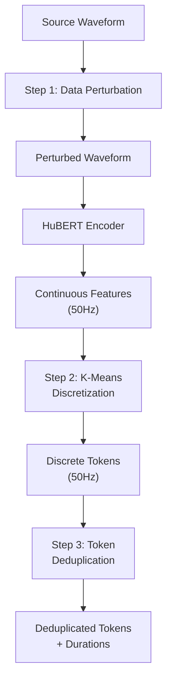

## 前置知识

> [!important]
> 
> 阅读本页前建议先读：[[R-VC- Rhythm Controllable Zero-Shot Voice Conversion via Shortcut Flow Matching]]

---

## 0. 定位

> [!important]
> 
> 本页聚焦 R-VC 的**内容提取模块**：如何通过数据扰动 → K-means 离散化 → Token 去重三步级联策略，从源语音中提取纯净的、不含说话人信息的内容表征。

---

## 1. 为什么需要三重净化？

HuBERT 特征虽然主要编码语音内容，但仍残留说话人信息：

- **连续空间中的说话人变异**：同一音素在不同说话人嘴里产生不同的 HuBERT 向量

- **时长中的说话人特征**：语速、停顿习惯是强说话人标识

- **口音/方言残留**：区域性发音变异被 HuBERT 编码

单一方法难以完全去除：K-means 能去除连续变异但保留时长信息；去重能去除时长但保留连续变异。因此需要**级联多步净化**。

---

## 2. 三步级联流程

---

## 3. Step 1: 数据扰动

三种信号级扰动并行施加：

|扰动类型|操作|目标|参数范围|**Formant Shifting**|改变共振峰频率（声道形状）|破坏说话人声道特征|shift ratio ∈ [-2, 2] semitones|
|---|---|---|---|---|---|---|---|
|**Pitch Randomization**|随机缩放基频轮廓|破坏说话人基频模式|scale ∈ [0.8, 1.2]|**Parametric EQ**|随机增益的多频段均衡|破坏说话人频谱包络|8 bands, gain ∈ [-6, 6] dB|

> [!important]
> 
> **工程判断：扰动强度的 trade-off**
> 
> 扰动太弱 → 说话人信息残留 → 音色泄漏；扰动太强 → 语音内容被破坏 → WER 升高。论文通过网格搜索找到最优范围，关键发现是 **Formant Shifting 对去音色贡献最大**（因为共振峰是说话人最强的声学标识），而 Pitch Randomization 对去风格贡献最大。

> [!important]
> 
> **思辨：数据扰动 vs. Seed-VC 的 Timbre Shifter**
> 
> 两者目标相同（破坏源音色），但策略层次不同：
> 
> - 数据扰动在**信号层**操作（DSP 变换），快速、确定性、无外部依赖，但只能做有限的变换（声道变形、基频缩放）
> 
> - Timbre Shifter 在**模型层**操作（外部 VC 模型），变换更彻底（整个音色被替换），但引入外部模型依赖和计算开销
> 
> **结论**：数据扰动更适合工程落地（无额外模型、快速训练），Timbre Shifter 更适合追求极致去音色效果的研究场景。R-VC 的结果（SECS=0.930 ≈ CosyVoice 0.933）证明信号级扰动在实践中已经足够好。

---

## 4. Step 2: K-Means 离散化

对扰动后语音提取 HuBERT 特征，然后用预训练的 K-means 模型离散化：

- 聚类数：K=2000（经验值）

- 特征层：HuBERT Layer 6-9 的加权平均

- 作用：将连续空间中的说话人变异「硬截断」为有限类别

---

## 5. Step 3: Token 去重

合并连续相同的 token，输出去重序列和对应时长：

- 输入：`[12, 12, 12, 45, 45, 78, 78, 78, 78]`（9 帧, 50Hz）

- 输出：tokens = `[12, 45, 78]`, durations = `[3, 2, 4]`

**关键作用**：将时长信息从内容表征中**完全分离**，使后续 Duration Model 可以独立建模目标说话人的节奏。

---

## 6. 消融实验

|配置|WER ↓|SECS ↑|说明|
|---|---|---|---|
|仅扰动|3.12|0.918|扰动有效提升去音色|
|**扰动 + 离散化 + 去重**|**3.51**|**0.930**|三重净化效果最佳|

---

## 延伸阅读

> [!important]
> 
> - 兄弟页面：[[R-VC- Rhythm Controllable Zero-Shot Voice Conversion via Shortcut Flow Matching]]
> 
> - 下一页推荐：L2-2 Mask Transformer Duration Model

## 参考文献

- [Zuo et al., 2025] R-VC 原论文 §3.1 Content Extraction

- [Hsu et al., 2021] HuBERT

- [Li et al., 2024] "SEF-VC" — 数据扰动策略的先驱工作