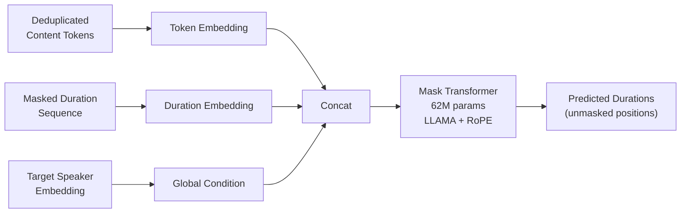

## 前置知识

> [!important]
> 
> 阅读本页前建议先读：L2-1 三重内容净化策略（了解去重 token 和分离时长的来源）

---

## 0. 定位

> [!important]
> 
> 本页聚焦 R-VC 的**节奏建模模块**：如何用 Mask Transformer 非自回归地预测目标说话人的 token 时长，实现节奏可控的零样本语音转换。本页不涉及声学生成（见 L2-3/L2-4）。

---

## 1. 为什么需要 Duration Model？

传统 VC 直接保留源语音的时长/节奏 → 两个问题：

1. **时长中携带说话人特征**：语速习惯、停顿模式是身份标识

1. **风格不匹配**：源说话人的节奏不适配目标说话人

R-VC 通过 Token 去重将时长信息从内容中分离，然后用 Duration Model 根据**目标说话人**的风格重新预测每个 token 的时长。

---

## 2. 模型架构

|组件|规格|架构|LLAMA-style Transformer + RoPE|
|---|---|---|---|
|参数量|62M|输入|去重 content tokens + 部分可见时长 + speaker embedding|
|输出|每个 token 的预测时长（整数）|训练目标|Cross-entropy（时长离散化为类别）|

---

## 3. 掩码生成式训练

### 3.1 正弦掩码调度

训练时随机掩码一部分时长值，让模型预测被掩码的时长：

KaTeX parse error: Undefined control sequence: \[ at position 38: …sim \mathcal{U}\̲[̲0, \pi/2\]

$p$ 是掩码比例。正弦调度使模型在训练中看到从少掩码（简单）到多掩码（困难）的均匀分布。

### 3.2 迭代解码

推理时采用迭代解码，逐轮减少掩码数量：

1. 初始：所有时长位置被掩码

1. 每轮：模型预测所有掩码位置 → 选择置信度最高的 $n$ 个位置解掩 → 其余重新掩码

1. 重掩数量线性衰减：$n = N cdot frac{T-t}{T}$

1. 重复直至所有位置解掩

> [!important]
> 
> **思辨：NAR Mask Transformer vs. AR Duration Model**
> 
> 传统 TTS 通常用 AR 或回归模型预测时长。R-VC 选择 NAR 掩码生成式的理由：
> 
> 1. **全局一致性**：NAR 每轮都能看到全局信息，避免 AR 的累积误差导致的时长漂移
> 
> 1. **速度**：NAR 迭代解码通常 4-8 轮即可收敛，远快于 AR 逐位置生成
> 
> 1. **适合离散输出**：时长天然是整数，掩码预测+argmax 比回归更稳定
> 
> 代价是 NAR 缺少 AR 的严格因果依赖建模，但论文实验表明节奏控制准确率达 90.2%，证明迭代精化足以弥补这一缺陷。

---

## 4. 节奏控制效果

- PPS（Phonemes Per Second）分类准确率：**90.2%**

- 生成语音的节奏显著接近目标说话人，而非源说话人

---

## 延伸阅读

> [!important]
> 
> - 上一页：L2-1 三重内容净化策略
> 
> - 下一页推荐：L2-3 Shortcut Flow Matching 原理与实现

## 参考文献

- [Zuo et al., 2025] R-VC 原论文 §3.2 Duration Model

- [Chang et al., 2022] "MaskGIT" — Mask-predict 生成式框架的先驱

- [Ren et al., 2020] "FastSpeech 2" — 传统 Duration Model 对比