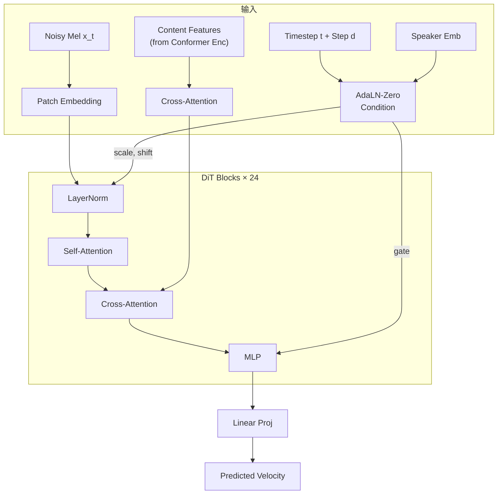

## 前置知识

> [!important]
> 
> 阅读本页前建议先读：L2-3 Shortcut Flow Matching（了解 DiT 的训练目标）

---

## 0. 定位

> [!important]
> 
> 本页聚焦 R-VC 声学生成器的**具体网络架构**：Diffusion Transformer (DiT) + AdaLN-Zero 条件注入，以及 DiT vs. U-Net 在语音生成中的对比。

---

## 1. DiT 架构概览

---

## 2. AdaLN-Zero 条件注入

标准 AdaLN（Adaptive Layer Normalization）将条件信息通过 scale/shift 注入每一层：

$$\text{AdaLN}(h, c) = \gamma(c) \cdot \frac{h - \mu(h)}{\sigma(h)} + \beta(c)$$

**AdaLN-Zero** 的改进：在残差连接前额外加一个 **gate 参数** $alpha(c)$，初始化为 0：

$$h_{\text{out}} = h + \alpha(c) \cdot \text{Block}(\text{AdaLN}(h, c))$$

> [!important]
> 
> **思辨：为什么 AdaLN-Zero 比 Cross-Attention 条件注入更好？**
> 
> DiT 原论文（Peebles & Xie, 2023）在图像生成中对比了 4 种条件注入方式，AdaLN-Zero 效果最佳。原因在于：
> 
> 1. **零初始化 gate** 使网络在训练初期表现为 identity mapping，梯度流更稳定
> 
> 1. **逐层调制** 比 cross-attention 更轻量（无额外注意力头的计算量）
> 
> 1. **全局条件**（timestep, speaker）适合通过 AdaLN 注入；**序列条件**（content features）适合通过 cross-attention 注入
> 
> R-VC 的设计正是这一最佳实践：AdaLN-Zero 处理全局条件，Cross-Attention 处理序列条件。

---

## 3. 关键设计细节

|组件|R-VC DiT|说明|
|---|---|---|
|隐藏维度|1024|—|
|音色注入|Masked mel prompt + Global spk emb|与 Voicebox/Seed-VC 类似的 ICL 方式|
|Vocoder|HiFi-GAN|从 Mel → Waveform|

---

## 4. DiT vs. U-Net 对比

论文通过替换实验对比了 DiT 和 U-Net 作为 FM backbone 的效果：

|Backbone|Params|SECS ↑|WER ↓|UTMOS ↑|
|---|---|---|---|---|
|**DiT (300M)**|300M|**0.930**|**3.51**|**3.91**|

> [!important]
> 
> **工程判断：何时选 DiT，何时选 U-Net？**
> 
> - **数据充足 + 计算预算充裕**（如 R-VC 的 20K hr MLS）→ DiT 的 scaling 优势明显
> 
> - **数据有限 + 低预算**（如 <1K hr）→ U-Net 的归纳偏置更有效率
> 
> - **关键区别**：DiT 没有多尺度下采样，完全依靠 attention 学习全局依赖；U-Net 的多尺度结构在小数据下提供了更强的归纳偏置

---

## 5. 与 Seed-VC U-DiT 的对比

|维度|R-VC DiT|Seed-VC U-DiT|Skip connection|无（标准 DiT）|有（U-Net style）|
|---|---|---|---|---|---|
|条件注入|AdaLN-Zero|Time-as-Token prefix|下采样|无|无|
|位置编码|RoPE|RoPE|特色|纯 DiT + Shortcut FM|U-Net 跳跃连接 + 时间作 token|

Seed-VC 的 U-DiT 更像传统 U-Net 和 Transformer 的混合体，而 R-VC 选择更纯粹的 DiT 设计。

---

## 延伸阅读

> [!important]
> 
> - 上一页：L2-3 Shortcut Flow Matching
> 
> - 下一页推荐：L2-5 实验与消融分析

## 参考文献

- [Peebles & Xie, 2023] "Scalable Diffusion Models with Transformers" — DiT 原论文

- [Zuo et al., 2025] R-VC 原论文 §3.3 Acoustic Model