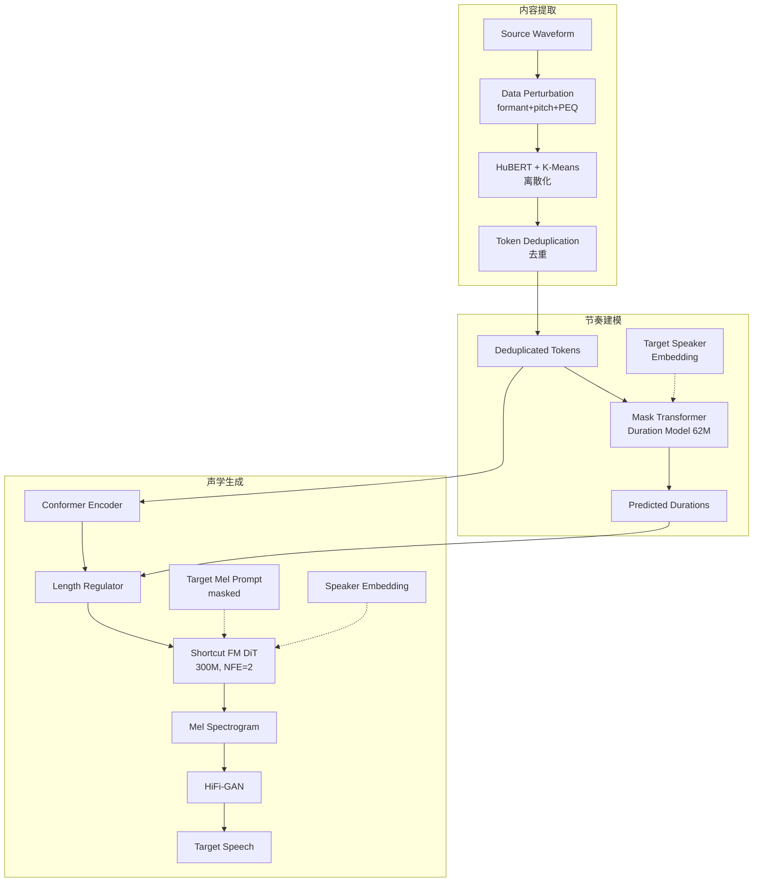

## 前置知识

> [!important]
> 
> 阅读本页前建议了解：Conditional Flow Matching (OT-CFM)、Diffusion Transformer (DiT)、HuBERT 自监督特征、掩码生成式 Transformer

---

## 0. 定位

> [!important]
> 
> **R-VC**（Zhejiang Univ. & Huawei Cloud, arXiv Jun 2025）是一个**节奏可控 + 低延迟**的零样本语音转换系统。三大创新：① 数据扰动 + 离散化 + 去重的三重内容净化策略；② Mask Transformer 非自回归建模目标说话人节奏；③ Shortcut Flow Matching 将采样步数从 10 降至 2，实现 2.83× 加速且性能无损。仅用 20K 小时 MLS 训练，音色相似度媲美 171K 小时训练的 CosyVoice。

---

## 1. 核心问题

1. **韵律中的音色泄漏**：保留源语音韵律会携带说话人特征（如语速习惯、重音模式），导致音色泄漏

1. **无法迁移目标节奏**：现有 VC 方法固定保留源语音的时长/节奏，无法适配目标说话人的说话风格

1. **Flow Matching 高延迟**：标准 CFM 需 10-32 步采样，限制了实时应用场景

---

## 2. 系统架构

---

## 3. 核心创新详解

### 3.1 三重内容净化

|步骤|方法|去除的信息|① 数据扰动|Formant Shifting + Pitch Randomization + Parametric EQ|说话人声道特征、基频模式、频谱包络|
|---|---|---|---|---|---|
|② K-means 离散化|HuBERT 50Hz 特征 → K-means 聚类|连续空间中的说话人变异|③ Token 去重|合并连续重复 token，分离 unit-level 时长|时长/节奏中的说话人特征 + 口音残留|

> [!important]
> 
> **思辨：三重净化 vs. Vevo 的 VQ-VAE 瓶颈**
> 
> Vevo 用 VQ-VAE 码本大小控制信息瓶颈，优势是端到端优化且不需要外部数据增强；R-VC 用数据扰动+离散化+去重，优势是工程简单（无需训练 VQ-VAE）且净化更彻底（WER=3.51 vs. Vevo 9.731）。代价是引入了外部增强的超参数（formant shift 范围、pitch 随机化幅度等），且去重操作丢失了时长信息需要额外模块恢复。**在数据充足时 VQ-VAE 更优雅，在工程落地时三重扰动更可控。**

### 3.2 Mask Transformer Duration Model

- **非自回归**掩码生成式 Transformer（LLAMA 架构 + RoPE），62M 参数

- 正弦掩码调度：$p = sin(u)$ , 无效的公式

- 条件：去重 content tokens + 未掩码时长 + 说话人 embedding

- 迭代解码：线性衰减重掩 $n = N \cdot \frac{T-t}{T}$ ，逐轮精化

- **节奏控制准确率 90.2%**（PPS 分类）

### 3.3 Shortcut Flow Matching

核心思想：在标准 OT-CFM 基础上，额外以步长 $d$ 为条件，训练模型学会「跳跃」——大步长时预判未来曲率并直接到达正确位置。

KaTeX parse error: Undefined control sequence: \[ at position 40: …}} = \mathbb{E}\̲[̲\|s_\theta(x_t,…

其中 无效的公式 （自洽目标）。

- 混合训练：70% FM 目标 + 30% 自洽目标

- NFE=2 即达 NFE=10 性能，RTF 从 0.34 → 0.12（**2.83× 加速**）

> [!important]
> 
> **思辨：Shortcut FM vs. 蒸馏/一致性模型**
> 
> Shortcut FM 的优势在于**不需要预训练 teacher 模型**——自洽损失直接在训练中引导模型学习大步跳跃，无需额外的 distillation pipeline。相比之下，Consistency Models 需要 EMA teacher，Progressive Distillation 需要逐阶段蒸馏。Shortcut FM 的代价是每个 batch 30% 样本需两次前向传播，但总计算量远小于蒸馏方案。

---

## 4. 五维度技术定位

|维度|方案|关键指标|**Content 解耦**|三重扰动 + K-means + 去重|WER=3.51; CER=1.40|
|---|---|---|---|---|---|
|**Timbre 建模**|DiT ICL: masked mel prompt + global spk emb|SECS=0.930; SMOS=4.11|**Style 控制**|Mask Transformer Duration Model|EMO=0.590; 节奏 ACC=90.2%|
|**Train-Infer 一致性**|数据扰动对齐训练推理；mask-reconstruct ICL|20K hr MLS 训练|**低延迟**|Shortcut FM: NFE=2|RTF=0.12（2.83× faster）|

---

## 5. 关键实验结论

- 仅 20K hr 训练，SECS=0.930 ≈ CosyVoice(0.933, 171K hr)，但 WER=3.51 远优于 CosyVoice(5.95)

- 情感迁移 EMO=0.590 >> 所有 baseline（CosyVoice: 0.395, HierSpeech++: 0.489）

- Shortcut FM NFE=2: SECS/WER/UTMOS 与 NFE=10 几乎无差（0.930 vs 0.931）

- DiT 在大参数量(300M)+大数据(MLS)下全面超越 U-Net（SECS: 0.930 vs 0.925）

---

## 延伸阅读

> [!important]
> 
> 子页面（按推荐阅读顺序）：
> 
> 1. L2-1: 三重内容净化策略
> 
> 1. L2-2: Mask Transformer Duration Model
> 
> 1. L2-3: Shortcut Flow Matching 原理与实现
> 
> 1. L2-4: DiT 解码器架构（AdaLN-Zero）
> 
> 1. L2-5: 实验与消融分析

## 参考文献

- [Zuo et al., 2025] "R-VC: Rhythm Controllable and Efficient Zero-Shot Voice Conversion via Shortcut Flow Matching." arXiv:2506.01014.

- [Frans et al., 2024] "One Step Diffusion via Shortcut Models" — Shortcut FM 原始论文

- [Du et al., 2024] "CosyVoice" — 对比 baseline

- [Lipman et al., 2022] "Flow Matching for Generative Modeling" — FM 理论基础

- [Peebles & Xie, 2023] "Scalable Diffusion Models with Transformers" — DiT 架构

[[L2-1- 三重内容净化策略]]

[[L2-2- Mask Transformer Duration Model]]

[[L2-4- DiT 解码器架构（AdaLN-Zero）]]

[[L2-3- Shortcut Flow Matching 原理与实现]]

[[论文库/R-VC Rhythm Controllable Zero-Shot Voice Conversio/L2-5- 实验与消融分析|L2-5- 实验与消融分析]]