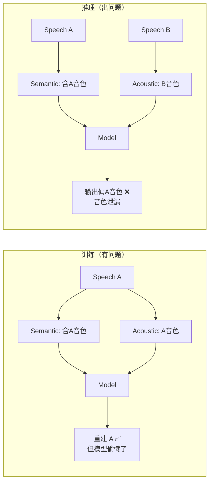
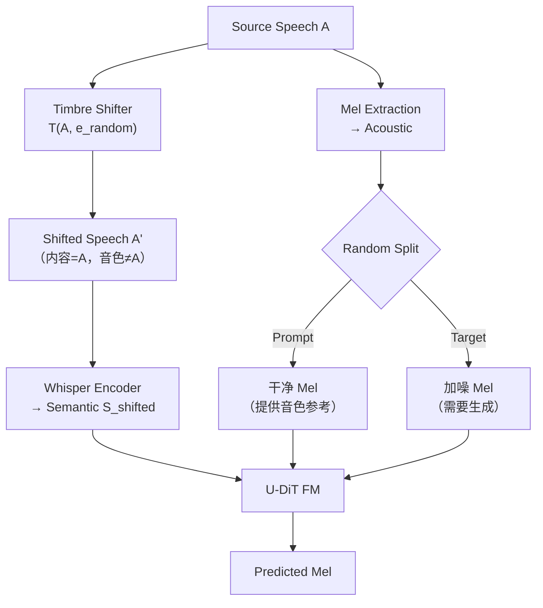

## 前置知识

> [!important]
> 
> 阅读本页前建议先读：[[Seed-VC- Zero-shot Voice Conversion with Diffusion Transformers]]

---

## 0. 定位

> [!important]
> 
> 本页聚焦 Seed-VC 的**核心创新**：外部音色偏移器（Timbre Shifter）如何解决零样本 VC 中训练-推理不一致的根本问题。本页不涉及 U-DiT 架构细节（见 L2-2）。

---

## 1. 问题根源：Train-Infer Mismatch

标准零样本 VC 训练流程：

- **训练时**：模型从语音 A 提取语义 + 从语音 A 提取声学 → 重建语音 A（自重建）

- **推理时**：模型从语音 A 提取语义 + 从语音 B 提取声学 → 生成语音 B 的音色说 A 的内容

问题：训练时语义特征包含源说话人音色信息（因为来自同一语音），模型学会了「偷懒」——直接从语义特征中提取音色辅助重建，而非仅依赖声学 prompt。推理时语义来自不同说话人 → 携带错误音色 → 音色泄漏。

---

## 2. 解决方案：Timbre Shifter

**核心思想极简**：训练时先用外部模型把源语音的音色改掉，再从变色语音中提取语义 → 语义特征不再携带源音色 → 训练 ≈ 推理。

---

## 3. Shifter 的选择

|Shifter 类型|代表模型|优势|劣势|
|---|---|---|---|
|**TTS 声学模块**|CosyVoice diffusion|给定不同参考自然改色|需要 TTS 系统|

> [!important]
> 
> **思辨：为什么 Shifter 不需要高质量？**
> 
> Shifter 的目标不是生成好听的语音，而是「让语义特征携带的音色 ≠ 源音色」。即使 Shifter 输出有明显伪影，只要音色足够不同，Whisper encoder 提取的语义特征就不会偷懒利用源音色。这是一个优雅的洞察：**不完美的工具反而更好用**——完美保真的 Shifter 反而可能保留太多源音色线索。
> 
> 实验验证：用质量参差不齐的 OpenVoiceV2 做 Shifter，SECS 仍从 0.7948 提升至 0.8676。

---

## 4. 与其他 Mismatch 解决方案对比

|方法|论文|策略|优势|劣势|
|---|---|---|---|---|
|**VQ-VAE 信息瓶颈**|Vevo|量化滤除音色 → 无 mismatch|端到端、无外部依赖|内容损失（WER↑）|
|**无处理**|FreeVC|期望瓶颈层自动过滤|最简单|mismatch 严重|

---

## 5. 消融实验

|配置|SECS ↑|WER ↓|
|---|---|---|
|**有 Timbre Shifter**|**0.8676**|**11.99**|

Timbre Shifter 同时提升了音色相似度（+9.2%）和内容保持度（WER↓6.6%），因为模型被迫从声学 prompt 而非语义特征中获取音色。

---

## 延伸阅读

> [!important]
> 
> - 下一页推荐：L2-2 U-DiT 架构与 Flow Matching
> 
> - 对比阅读：[[L2-1- 渐进自监督解耦方法（VQ-VAE 信息瓶颈详解）]]、[[L2-1- 三重内容净化策略]]

## 参考文献

- [Liu, 2024] Seed-VC 原论文 §3.1 Timbre Shifter

- [Qin et al., 2024] "OpenVoice" — Shifter 候选模型