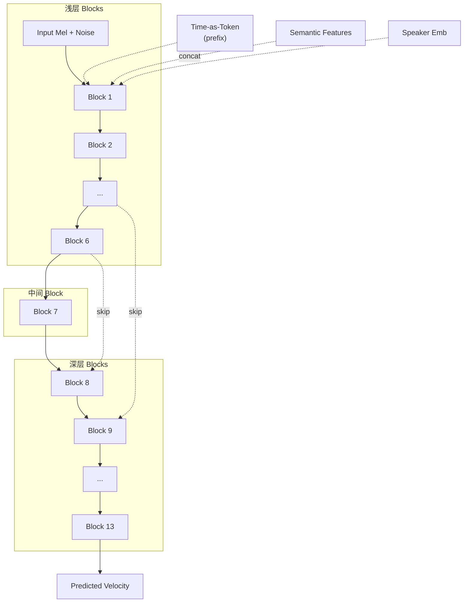

## 前置知识

> [!important]
> 
> 阅读本页前建议先读：L2-1 外部音色偏移器

---

## 0. 定位

> [!important]
> 
> 本页聚焦 Seed-VC 的声学生成器架构：U-DiT（带 U-Net 风格跳跃连接的 Diffusion Transformer）+ Flow Matching 的具体设计，以及与 R-VC DiT / Vevo FM-Transformer 的横向对比。

---

## 1. U-DiT 架构设计

### 关键设计选择

|设计点|Seed-VC U-DiT|R-VC DiT|Vevo FM-Transformer|
|---|---|---|---|
|**时间步注入**|Time-as-Token（prefix token）|AdaLN-Zero|AdaLN|
|**下采样**|无|无|无|
|**singing 参数量**|~200M（17层, 12头, 768dim）|—|—|

> [!important]
> 
> **思辨：Time-as-Token vs. AdaLN-Zero**
> 
> 两者都是向 Transformer 注入时间步条件的方法，但理念不同：
> 
> - **AdaLN-Zero**（R-VC）：通过 scale/shift/gate 逐层调制，计算量小但信息流是「全局广播」式的
> 
> - **Time-as-Token**（Seed-VC）：将时间步编码为一个 prefix token 参与 self-attention，信息流通过注意力机制自然融入
> 
> Time-as-Token 更符合 Transformer 的原生设计哲学（万物皆 token），但增加了序列长度。AdaLN-Zero 更轻量。DiT 原论文证明 AdaLN-Zero 在图像生成中更优，但语音领域尚无定论。

---

## 2. Flow Matching 配置

- **OT-CFM**（Optimal Transport Conditional Flow Matching）

- 线性插值路径：$x_t = (1-t)x_0 + tx_1$

- Euler ODE solver

- 采样步数：未专门优化（可参考 R-VC 的 Shortcut FM 方案）

---

## 3. In-Context Learning 音色注入

训练时随机选取同一语音的一段作为声学 prompt（不加噪），其余部分从噪声生成。推理时用目标说话人的完整参考 Mel 作为 prompt。

消融实验：无完整参考 → SECS=0.7948；加入完整参考 → SECS=0.8676（+9.2%）。

> [!important]
> 
> **工程判断：U-DiT 的 skip connection 在语音中是否必要？**
> 
> U-Net 风格的 skip connection 在图像生成中帮助保留低级细节。在语音中，Mel 频谱的局部纹理（如谐波结构）同样需要低级特征。但 R-VC 的纯 DiT（无 skip）在 300M 参数下性能更好（SECS 0.930 vs Seed-VC 0.8676），暗示**在充分大的模型和数据下，skip connection 的收益可能被 scaling 效应覆盖**。小模型（~100M）下 skip 可能仍有价值。

---

## 延伸阅读

> [!important]
> 
> - 上一页：L2-1 外部音色偏移器
> 
> - 下一页推荐：L2-3 歌声转换扩展
> 
> - 对比阅读：[[L2-4- DiT 解码器架构（AdaLN-Zero）]]

## 参考文献

- [Liu, 2024] Seed-VC 原论文 §3.2 U-DiT Architecture

- [Peebles & Xie, 2023] "Scalable Diffusion Models with Transformers" — DiT