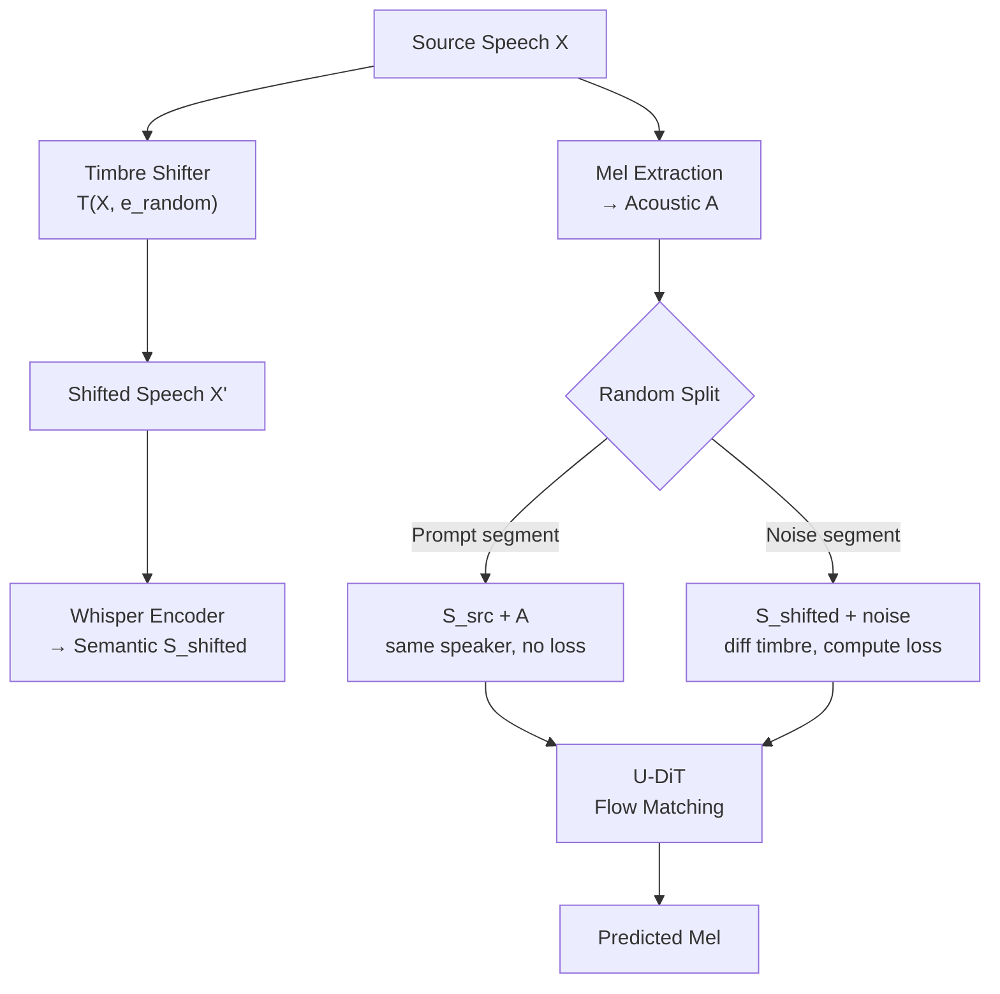

## 前置知识

> [!important]
> 
> 阅读本页前建议了解：Flow Matching 生成模型、Whisper ASR 模型架构、Diffusion Transformer (DiT)、Voice Conversion 基本范式

---

## 0. 定位

> [!important]
> 
> **Seed-VC**（arXiv Nov 2024）首次提出**外部音色偏移器（Timbre Shifter）**策略解决零样本 VC 中训练-推理不一致的核心痛点。通过在训练时对源语音施加音色变换，使语义特征不再携带源音色，训练场景得以对齐推理场景。搭配 U-DiT Flow Matching 解码器和 in-context timbre learning，在 101K 小时 Emilia 数据集上实现 SOTA 零样本 VC，并扩展至歌声转换。

---

## 1. 核心问题

> [!important]
> 
> **零样本 VC 三大挑战**：
> 
> 1. **Train-Infer Mismatch**：训练时模型自重建同一说话人语音（语义特征含源音色可"作弊"）→ 推理时跨说话人（语义特征携带错误音色）→ 音色泄漏
> 
> 1. **单向量音色表征不足**：全局 speaker embedding 难以捕获说话人的时变声学特征
> 
> 1. **连续语义特征的音色残留**：Whisper/HuBERT 的连续特征不可避免地保留部分说话人信息

---

## 2. 核心创新

### 2.1 外部音色偏移器（Timbre Shifter）

**核心思想**：训练时用外部 VC/TTS 模型改变源语音的音色 → 从变换后语音提取语义特征 → 语义特征不再携带源音色 → 训练 ≈ 推理。

**两类 Shifter 选择**：

- 非完美零样本 VC 模型（OpenVoiceV2 / YourTTS）：足够改变音色即可

- TTS 声学模块（如 CosyVoice diffusion）：给定不同参考天然改变音色

> [!important]
> 
> **思辨：Timbre Shifter vs. R-VC 的数据扰动 vs. Vevo 的 VQ-VAE**
> 
> 三种方法都在解决 train-infer mismatch，但策略截然不同：
> 
> - **Vevo**：不处理 mismatch，因为 VQ-VAE 量化已经滤掉音色 → 自重建 ≈ 跨说话人
> 
> - **R-VC**：信号级扰动（formant/pitch/EQ）破坏源音色 → 简单但可能扭曲内容
> 
> - **Seed-VC**：模型级变换（外部 VC/TTS）替换音色 → 最灵活但引入了外部模型依赖
> 
> **关键区别**：Seed-VC 的 Shifter 不要求高质量，只需「足够不同」即可，因此即使 OpenVoice 这类中等质量的 VC 模型也能胜任。这是一个优雅的工程取舍。

### 2.2 U-DiT 架构

- **U-Net style skip connection**（无下采样）：浅层→深层跳跃连接

- **Time-as-Token**：时间步作为序列 prefix token（非传统 AdaLN）

- **RoPE**：旋转位置编码

- base: 13 层、8 头、512 dim → 22.05kHz mel (80 bins)

- singing: 17 层、12 头、768 dim → 44.1kHz mel (128 bins)

### 2.3 增强音色表征（In-Context Learning）

训练时随机选取声学片段作为 prompt → 推理时注入完整参考语音 → SECS 从 0.7948 → 0.8676

---

## 3. 五维度技术定位

| 维度                  | 方案                              | 关键指标         |
| ------------------- | ------------------------------- | ------------ |
| **Timbre 建模**       | CAM++ global emb + 完整参考 mel ICL | SECS=0.8676  |
| **Train-Infer 一致性** | **Timbre Shifter** 对齐训练推理       | 核心创新         |
| **Content 解耦**      | Whisper-small encoder 连续语义特征    | 保留语言细节但有音色残留 |
| **Style 控制**        | 无显式风格控制；语义特征保留源韵律               | —            |
| **低延迟**             | Flow Matching（未优化步数）            | —            |

---

## 4. 关键实验结论

- 101K hr Emilia 训练 → SECS=0.8676 > OpenVoice(0.7547) / CosyVoice(0.8440)

- WER=11.99% < CosyVoice(18.98%)

- 歌声转换：F0CORR=0.9375 ≈ RVCv2(0.9404)；CER=19.70% << RVCv2(28.46%)

- Timbre Shifter 消融：无 Shifter → SECS=0.7948（↓0.0728）

- ICL 消融：无完整参考 → SECS=0.7948 → 加入完整参考 → 0.8676

---

## 延伸阅读

> [!important]
> 
> 子页面（按推荐阅读顺序）：
> 
> 1. L2-1: 外部音色偏移器（Timbre Shifter）详解
> 
> 1. L2-2: U-DiT 架构与 Flow Matching
> 
> 1. L2-3: 歌声转换扩展（F0 Conditioning）
> 
> 1. L2-4: 实验与消融分析

## 参考文献

- [Liu, 2024] "Zero-shot Voice Conversion with Diffusion Transformers." arXiv 2024.

- [Peebles & Xie, 2023] "Scalable Diffusion Models with Transformers" — DiT

- [Du et al., 2024] "CosyVoice" — 对比 baseline / Timbre Shifter 候选

- [Qin et al., 2024] "OpenVoice" — Timbre Shifter 候选模型

[[L2-1- 外部音色偏移器（Timbre Shifter）详解]]

[[L2-3- 歌声转换扩展（F0 Conditioning）]]

[[L2-4- 实验与消融分析]]

[[L2-2- U-DiT 架构与 Flow Matching]]