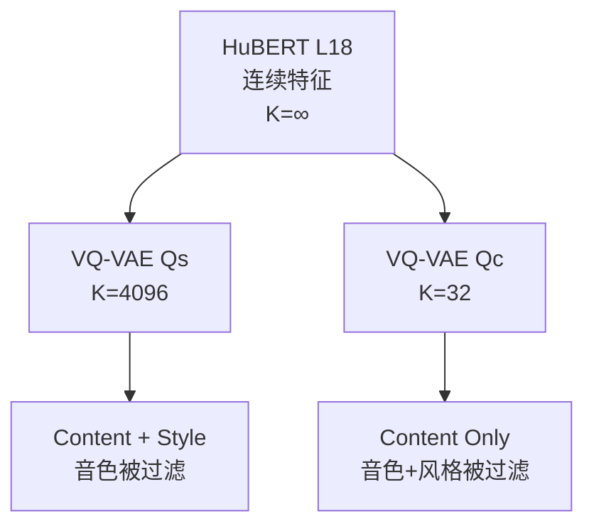

## 前置知识

> [!important]
> 
> 阅读本页前建议先读：[[VEVO- Controllable Zero-Shot Voice Imitation with Self-Supervised Disentanglement]]（了解整体框架定位）

---

## 0. 定位

> [!important]
> 
> 本页聚焦 Vevo 的**核心创新第一步**：如何通过 VQ-VAE 码本大小作为信息瓶颈，从 HuBERT 连续特征中渐进式分离出 content、style、timbre 三个维度的表征。本页不涉及后续的 AR/FM 生成阶段（见 L2-2、L2-3）。

---

## 1. 核心思想：码本大小 = 信息容量

VQ-VAE 的本质是一个**有损压缩器**：将连续向量映射到 $K$ 个离散码字中最近的一个。$K$ 越小，瓶颈越窄，被过滤的信息越多。

Vevo 的关键洞察：**语音中不同层次的信息具有不同的冗余度**。

- **内容**（音素序列）：信息量最低，约 40-50 个音素即可覆盖一种语言 → $K=32$ 即可编码

- **风格**（口音、语调、情感）：信息量中等，需更多码字捕捉 → $K=4096$ 可编码内容+风格

- **音色**（说话人声道特征）：信息量最高，需连续表征或极大码本 → $K→\infty$ 才能完整保留

---

## 2. 两个 VQ-VAE Tokenizer

|Tokenizer|输入|码本 $K$|输出标记|保留信息|训练目标|
|---|---|---|---|---|---|
|**Content** ( $Q_c$ )|HuBERT L18 特征|32|content tokens|仅内容|最小化 HuBERT 特征重建误差|

两个 VQ-VAE 独立训练，架构相同（RepCodec），仅码本大小不同。

### 2.1 RepCodec 架构

- Encoder: 1D Conv 下采样（50Hz → 50Hz，不改变时间分辨率）

- Quantizer: 标准 VQ（commitment loss + EMA codebook update）

- Decoder: 1D Conv 上采样 + 重建 HuBERT 特征

> [!important]
> 
> **工程判断：为什么选 RepCodec 而非 RVQ？**
> 
> Vevo 选择单码本 VQ-VAE 而非残差向量量化（RVQ），原因在于 RVQ 通过多层残差恢复信息，相当于变相增大了有效码本容量（$K_{text{eff}} = K^L$），削弱了信息瓶颈的控制精度。单码本让 $K$ 与信息容量的映射更直接、更可控。

---

## 3. Duration Reduction

Content tokens 仍保留帧级时长信息（50Hz），其中包含说话人的节奏习惯。Duration Reduction 通过合并连续相同 token 来去除时长：

- 输入：`[a, a, a, b, b, c, c, c, c]`（9 帧）

- 输出：`[a, b, c]`（3 个 unique tokens）+ 时长 `[3, 2, 4]`

消融实验证实其效果：DDUR 从 1.698→0.933，同时 A-SIM↑、E-SIM↑。

> [!important]
> 
> **思辨：Duration Reduction vs. R-VC 的 Token 去重**
> 
> 两者本质相同——合并连续重复 token 并分离时长。区别在于输入：Vevo 对 VQ-VAE 量化后的 token 去重（信息已被 $K=32$ 过滤），R-VC 对 K-means 量化后的 token 去重。Vevo 的优势是去重前已经通过 VQ-VAE 过滤了更多信息；R-VC 的优势是去重前通过数据扰动破坏了更多说话人特征。**两者策略正交，理论上可以叠加使用。**

---

## 4. 信息瓶颈实验验证

论文通过系统性消融验证了 $K$ 与信息过滤的关系：

|码本 $K$|WER ↓（内容保持）|S-SIM to src ↓（音色去除）|FPC ↓（风格去除）|16384|5.123|0.306|0.826|
|---|---|---|---|---|---|---|---|
|4096|5.421|0.253|0.812|1024|6.967|0.218|0.779|
|256|8.104|0.183|0.738|**32**|**9.731**|**0.161**|**0.706**|

**关键观察**：

- $K$ ↓ → S-SIM to src ↓（音色逐步被过滤）✅

- $K$ ↓ → FPC ↓（风格也逐步被过滤）✅

- $K$ ↓ → WER ↑（内容损失增加）⚠️ 这是瓶颈的代价

---

## 5. 与其他解耦方法横向对比

|方法|论文|去音色策略|优势|劣势|
|---|---|---|---|---|
|**数据扰动+K-means**|R-VC|formant/pitch/EQ 扰动 + 离散化|工程简单、WER 极低|超参数敏感；需额外 Duration Model|
|**外部 Timbre Shifter**|Seed-VC|外部 VC/TTS 改变训练时音色|灵活、不修改内部架构|依赖外部模型质量|

---

## 延伸阅读

> [!important]
> 
> - 兄弟页面：[[VEVO- Controllable Zero-Shot Voice Imitation with Self-Supervised Disentanglement]]
> 
> - 下一页推荐：L2-2 Content-Style Modeling（AR Transformer 风格建模）

## 参考文献

- [Huang et al., 2024] "RepCodec: A Speech Representation Codec for Speech Tokenization"

- [van den Oord et al., 2017] "Neural Discrete Representation Learning" — VQ-VAE

- [Hsu et al., 2021] "HuBERT: Self-Supervised Speech Representation Learning by Masked Prediction of Hidden Units"