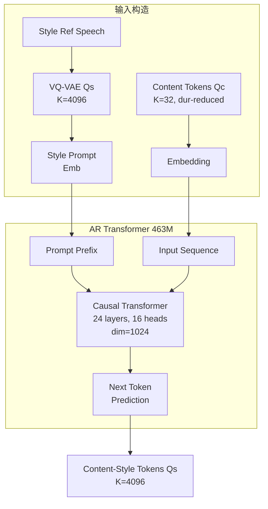

## 前置知识

> [!important]
> 
> 阅读本页前建议先读：L2-1 渐进自监督解耦方法（了解 $Q_c$ 和 $Q_s$ 的定义）

---

## 0. 定位

> [!important]
> 
> 本页聚焦 Vevo 双阶段生成的**第一阶段**：AR Transformer 如何从 content tokens（$Q_c$, $K$=32）生成 content-style tokens（$Q_s$, $K$=4096），实现**风格的注入与控制**。本页不涉及第二阶段的声学生成（见 L2-3）。

---

## 1. 任务定义

给定：

- **输入**：duration-reduced content tokens $Q_c$ （仅含内容信息）

- **条件**：style reference 语音的 content-style tokens（作为 prompt 前缀）

- **输出**：content-style tokens $Q_s$（含内容 + 目标风格）

本质上是一个**条件序列到序列的语言建模任务**：在 prompt 的风格分布引导下，将纯内容 token 序列扩展为携带目标风格的 token 序列。

---

## 2. 模型架构

### 关键设计

|组件|规格|说明|
|---|---|---|
|参数量|463M|24 层, 16 头, dim=1024|
|输入词表|32 (content) + 4096 (content-style)|两个 token 空间共享序列|
|训练数据|60K hr audiobook|自监督：同一语音的 $Q_c$ → $Q_s$|

---

## 3. In-Context Learning 机制

训练时，从**同一语音**随机截取一段作为 style prompt（提供风格参考），其余部分作为需要生成的目标。由于训练时 prompt 和 target 来自同一说话人，模型学会了从 prompt 中提取风格信息并应用到目标生成中。

推理时，将**不同说话人**的语音作为 style prompt → 实现零样本风格迁移。

> [!important]
> 
> **思辨：为什么 AR 比 NAR 更适合风格建模？**
> 
> 风格信息（口音、语调曲线、停顿模式）本质上是**序列级别的模式**——它们跨越多个 token，具有长程依赖。AR 模型通过逐步生成，每一步都能参考前面所有已生成的 token，天然擅长捕捉这种序列级别的分布。NAR 模型（如 Mask Transformer）虽然速度更快，但独立预测各位置时难以保持全局风格一致性。这也是为什么 R-VC 用 NAR 做 Duration Model（局部决策）而非风格建模。

---

## 4. Global Style Encoder（可选加速）

标准 AR 生成需要完整的 token-level prompt 前缀，序列较长。论文提出可选的 **Global Style Encoder**（WavLM + TDNN）将参考语音压缩为单一全局风格向量，替代 token-level prompt：

- 优势：序列长度缩短至 42%，生成速度提升

- 代价：风格信息损失（全局向量丢失时变细节）

- 消融结果：A-ACC 从 0.903 略降至 0.879

> [!important]
> 
> **工程判断：何时用 Global Style Encoder？**
> 
> - 离线场景（如配音制作）→ 用完整 token prompt，最大化风格保真度
> 
> - 在线场景（如实时转换）→ 用 Global Style Encoder，牺牲少量风格精度换取速度

---

## 延伸阅读

> [!important]
> 
> - 上一页：L2-1 渐进自监督解耦方法
> 
> - 下一页推荐：L2-3 Acoustic Modeling（Flow-Matching Transformer 音色建模）

## 参考文献

- [Zhang et al., 2025] Vevo 原论文 §3.3 Content-Style Modeling

- [Touvron et al., 2023] "LLaMA" — Decoder-only Transformer 架构参考

- [Su et al., 2024] "RoFormer" — RoPE 位置编码