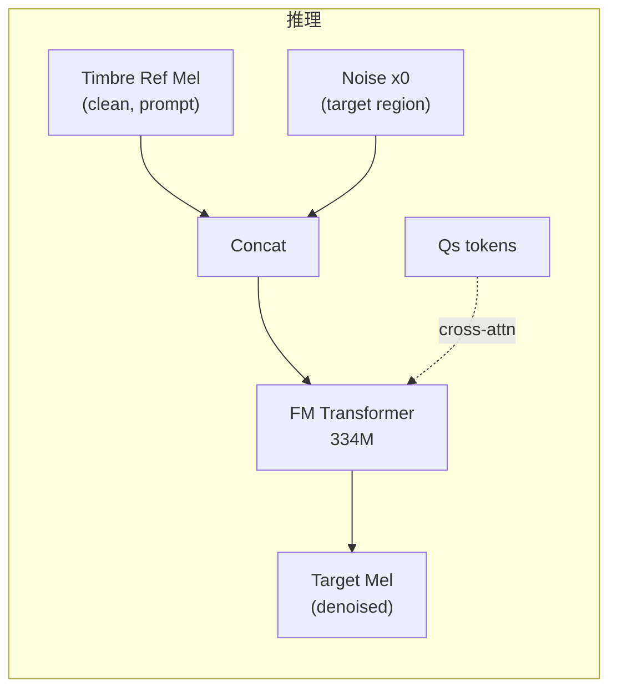

## 前置知识

> [!important]
> 
> 阅读本页前建议先读：L2-2 Content-Style Modeling（了解 $Q_s$ 的生成过程）

---

## 0. 定位

> [!important]
> 
> 本页聚焦 Vevo 双阶段生成的**第二阶段**：Flow-Matching Transformer 如何从 content-style tokens（$Q_s$）生成 Mel 频谱，实现**音色的注入与控制**。

---

## 1. 任务定义

给定：

- **输入**：content-style tokens $Q_s$（含内容 + 风格，不含音色）

- **条件**：timbre reference 的 Mel 频谱（作为 prompt）

- **输出**：目标 Mel 频谱（含内容 + 风格 + 目标音色）

---

## 2. Flow Matching 基础

Flow Matching 学习一个速度场 $v_theta(x_t, t)$，将噪声分布 $x_0 \sim \mathcal{N}(0, I)$ 在时间 无效的公式 内运输到数据分布 $x_1$：

$$\frac{dx_t}{dt} = v_\theta(x_t, t)$$

训练目标（OT-CFM）：

KaTeX parse error: Undefined control sequence: \[ at position 51: …}_{t, x_0, x_1}\̲[̲\|v_\theta(x_t,…

其中 $x_t = (1-t)x_0 + tx_1$ 是线性插值路径。

> [!important]
> 
> **思辨：为什么声学生成用 Flow Matching 而非 AR？**
> 
> Mel 频谱是**高维连续信号**（80-128 bins × 数百帧），逐帧 AR 生成会累积误差且速度极慢。Flow Matching 直接在连续空间做全局变换，一次生成整段 Mel，避免了自回归的错误累积和速度瓶颈。同时 FM 比 Diffusion 更高效——线性 OT 路径比 DDPM 的弯曲路径需要更少的采样步数。

---

## 3. Transformer 架构

|组件|规格|说明|架构|Non-causal Transformer|双向注意力，全序列可见|
|---|---|---|---|---|---|
|参数量|334M|24 层, 16 头, dim=1024|条件注入|AdaLN（时间步 $t$ ）+ Cross-Attention（$Q_s$ tokens）|—|
|位置编码|RoPE|—|采样步数|NFE=32（默认）|ODE solver: Euler|

---

## 4. Temporal Span Masking ICL

音色注入采用 **temporal span masking** in-context learning：

1. 训练时：从同一语音中选取一段连续 Mel 片段作为 prompt（不加噪），其余部分作为需要从噪声生成的 target

1. prompt 段和 target 段拼接为一个序列输入 Transformer

1. 模型通过双向注意力从 prompt（干净 Mel）中学习音色特征

推理时：将**目标说话人**的参考 Mel 作为 prompt → 零样本音色迁移。

> [!important]
> 
> **思辨：Span Masking ICL vs. Global Speaker Embedding**
> 
> 传统方法（如 FreeVC）用全局 speaker embedding（一个向量）表示音色，信息量有限且丢失时变特征。Span masking ICL 让模型直接看到完整的参考 Mel 频谱，相当于把「说话人模板」完整呈现，模型可以逐帧比对和模仿。代价是推理时序列更长（prompt + target），但音色保真度显著提升（S-SIM: 0.420 vs 全局 embedding 的 ~0.35）。Seed-VC 也采用了类似的 ICL 策略（SECS: 0.7948→0.8676）。

---

## 5. 与 R-VC / Seed-VC 声学建模对比

|维度|Vevo FM-Transformer|R-VC Shortcut FM DiT|Seed-VC U-DiT|架构|Non-causal Transformer|DiT + AdaLN-Zero|U-Net skip + Time-as-Token|
|---|---|---|---|---|---|---|---|
|条件注入|AdaLN + Cross-Attn|AdaLN-Zero + concat|Time-as-Token + concat|音色注入|Span masking ICL|Masked mel prompt ICL|Mel prompt ICL|
|采样步数|NFE=32|**NFE=2** (Shortcut)|未优化|参数量|334M|300M|~100M (base)|

---

## 延伸阅读

> [!important]
> 
> - 上一页：L2-2 Content-Style Modeling
> 
> - 下一页推荐：L2-4 四种零样本任务推理流水线

## 参考文献

- [Lipman et al., 2022] "Flow Matching for Generative Modeling"

- [Le et al., 2023] "Voicebox" — Span masking ICL 在语音生成中的应用

- [Zhang et al., 2025] Vevo 原论文 §3.4 Acoustic Modeling