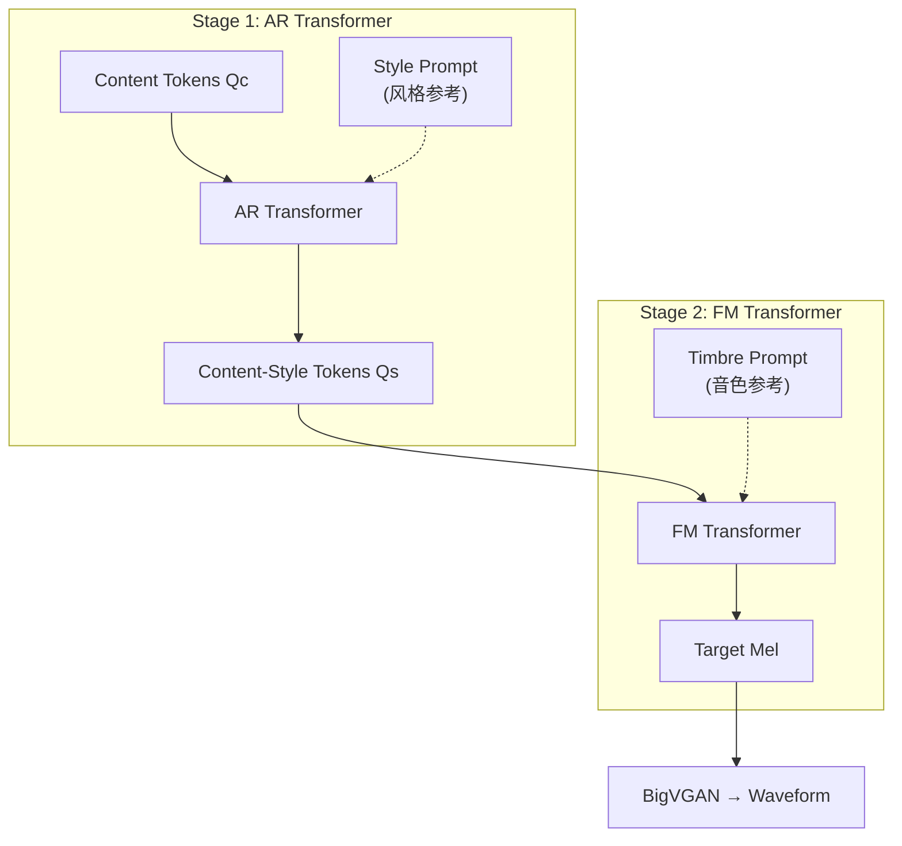

## 前置知识

> [!important]
> 
> 阅读本页前建议先读：L2-2 Content-Style Modeling 和 L2-3 Acoustic Modeling

---

## 0. 定位

> [!important]
> 
> 本页聚焦 Vevo 如何通过**同一套模型**，仅改变推理时的 prompt 配置，实现四种不同的零样本任务：纯音色转换、纯风格转换、完整语音模仿、零样本 TTS。

---

## 1. 统一推理框架

Vevo 的核心优势在于**解耦即可控**。因为音色和风格被分配到两个独立的生成阶段（AR 管风格，FM 管音色），推理时只需选择性地注入不同参考即可切换任务：

---

## 2. 四种任务变体

|变体|Stage 1 (AR)|Stage 2 (FM)|效果|典型场景|
|---|---|---|---|---|
|**Vevo-Style**|风格参考语音|源说话人 Mel|保持内容+音色，替换风格|口音/情感转换|
|**Vevo-TTS**|目标说话人语音|目标说话人 Mel|文本→目标音色+风格|零样本 TTS|

> [!important]
> 
> **误区纠正：「Vevo-Timbre 和 Vevo-Voice 的区别只是多了 AR 一步」**
> 
> 不准确。关键区别在于**风格的来源**：
> 
> - Vevo-Timbre 保留了源语音的风格（口音、语调）→ 跳过 AR，直接用源语音的 $Q_s$
> 
> - Vevo-Voice 采用了目标说话人的风格 → 用 AR 重新生成 $Q_s$
> 
> 这意味着 Vevo-Voice 的输出在口音和语调上也会接近目标说话人，而 Vevo-Timbre 只改变了声音音色。

---

## 3. Vevo-TTS 的特殊处理

Vevo-TTS 需要从文本而非语音获取 content tokens。论文采用外部 G2P + Duration Model 生成 content tokens：

1. 文本 → Phoneme 序列（G2P）

1. Phoneme → Content tokens $Q_c$（映射表或小模型）

1. 后续与其他变体相同

> [!important]
> 
> **工程判断：TTS 模式的局限性**
> 
> Vevo 的 TTS 模式依赖外部 G2P + Duration 预测，引入了额外的 pipeline 复杂度。这也是为什么 Vevo 主要定位于 VC 框架而非通用 TTS——纯 TTS 场景下 CosyVoice 和 MaskGCT 的端到端 pipeline 更简洁。但 Vevo 的独特价值在于**音色和风格可以来自不同参考**，这是端到端 TTS 难以实现的。

---

## 4. 四种任务的实验对比

|任务|指标|Vevo|最强 Baseline|优势幅度|
|---|---|---|---|---|
|Style (Accent)|A-ACC|**0.903**|0.571 (Conv-Speak)|+58%|
|TTS|ES-MOS|**4.03**|3.76 (MaskGCT)|+7%|

---

## 延伸阅读

> [!important]
> 
> - 上一页：L2-3 Acoustic Modeling
> 
> - 下一页推荐：L2-5 实验与消融分析

## 参考文献

- [Zhang et al., 2025] Vevo 原论文 §4 Experiments