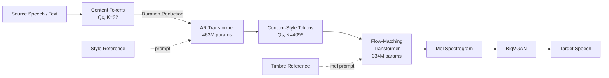

## 前置知识

> [!important]
> 
> 阅读本页前建议了解：HuBERT 自监督语音预训练、向量量化（VQ-VAE）、Flow Matching 生成模型、自回归 Transformer 语言模型基础

---

## 0. 定位

> [!important]
> 
> **Vevo**（ICLR 2025, Meta AI & CUHK-Shenzhen）是一个基于**自监督渐进解耦**的可控零样本语音模仿统一框架。核心创新在于通过 VQ-VAE 码本大小控制信息瓶颈宽度，逐级分离音色→风格→内容，并通过双阶段生成（AR + Flow-Matching）实现音色与风格的**独立可控**。仅用 60K 小时有声书自监督训练，无需口音/情感标注，零样本口音与情感转换即超越有监督 baseline。

---

## 1. 核心问题

现有零样本语音生成方法面临四大挑战：

1. **音色-风格耦合**：现有表征（如 HuBERT K-means tokens）难以有效分离 timbre 与 style，导致控制一个属性时另一个泄漏

1. **标注数据依赖**：风格模仿（口音/情感转换）依赖平行语料、风格标签或文本转录

1. **零样本风格模仿困难**：从几秒参考语音模仿口音/情感是公认的未解问题

1. **独立可控缺失**：现有方法无法在保持内容不变的前提下分别控制音色和风格

---

## 2. 核心创新

### 2.1 渐进自监督解耦

将 VQ-VAE 的码本大小 $K$ 视为**信息瓶颈宽度**，渐进过滤语音信息：

|阶段|表征|码本 $K$|保留信息|过滤信息|初始|HuBERT L18 连续特征|$\infty$|音色 + 风格 + 内容|—|
|---|---|---|---|---|---|---|---|---|---|
|Content-Style|VQ-VAE tokens ( $Q_s$ )|4096|风格 + 内容|音色|Content|VQ-VAE tokens ( $Q_c$ )|32|仅内容|音色 + 风格|

> [!important]
> 
> **思辨：为什么 VQ-VAE 比 K-means 更适合做信息瓶颈？**
> 
> 同等 $K=1024$ 下，VQ-VAE tokens WER=6.967 vs. K-means WER=11.493。VQ-VAE 通过端到端训练（encoder + VQ + decoder 联合优化重建损失），codebook 的信息分配更高效——有限的 $K$ 个码字被优化为最大化重建质量，而 K-means 仅做后处理聚类，无法根据下游重建目标调整编码策略。因此 VQ-VAE 能用更小的 $K$ 保留同等信息量，更精准控制瓶颈宽度 [Huang et al., 2024]。

### 2.2 双阶段生成框架

- **Content-Style Modeling**（AR Transformer）：从 content tokens 生成 content-style tokens，以 style reference 为 prompt → 控制**风格**

- **Acoustic Modeling**（Flow-Matching Transformer）：从 content-style tokens 生成 Mel，以 timbre reference 为 mel prompt → 控制**音色**

### 2.3 四种零样本任务统一推理

|变体|AR prompt (风格)|FM prompt (音色)|目标|应用|
|---|---|---|---|---|
|**Vevo-Style**|参考|源|保留内容+音色，替换风格|口音/情感转换|
|**Vevo-TTS**|参考|参考|文本→目标音色+风格|零样本 TTS|

---

## 3. 五维度技术定位

|维度|方案|关键指标|**Content 解耦**|HuBERT L18 + VQ-VAE( $K$ =32) + Duration Reduction|WER=9.731; S-SIM to src↓0.161|
|---|---|---|---|---|---|
|**Timbre 建模**|FM Transformer + temporal span masking ICL|S-SIM to ref=0.420; SS-MOS=3.36|**Style 控制**|AR Transformer + Global Style Encoder (WavLM+TDNN)|A-ACC=0.903; E-SIM=0.872|
|**Train-Infer 一致性**|纯自监督训练，同一语音训练两阶段，无需外部扰动|60K hr audiobook; 无标注|**低延迟**|FM NFE=32; AR 可选 global-guided 缩短至 42%|未专门优化|

---

## 4. 关键实验结论

- **零样本口音转换**：无需口音标注，Vevo-Style A-ACC=0.903 超越有监督 Conv-Speak(0.571)

- **零样本情感转换**：Vevo-Voice E-SIM=0.872 远超 HierSpeech++(0.658)、FACodec(0.688)

- **零样本 TTS**：ES-MOS=4.03 超越 CosyVoice(3.66) 和 MaskGCT(3.76)

- **信息瓶颈验证**：$K$ 从 16384→32，S-SIM to src 从 0.306↓0.161（音色渐去），FPC 从 0.826↓0.706（风格渐去）

- **Duration Reduction**：DDUR 从 1.698→0.933，A-SIM↑、E-SIM↑

---

## 延伸阅读

> [!important]
> 
> 子页面（按推荐阅读顺序）：
> 
> 1. L2-1: 渐进自监督解耦方法（VQ-VAE 信息瓶颈详解）
> 
> 1. L2-2: Content-Style Modeling（AR Transformer 风格建模）
> 
> 1. L2-3: Acoustic Modeling（Flow-Matching Transformer 音色建模）
> 
> 1. L2-4: 四种零样本任务推理流水线
> 
> 1. L2-5: 实验与消融分析

## 参考文献

- [Zhang et al., 2025] Xueyao Zhang et al. "VEVO: Controllable Zero-Shot Voice Imitation with Self-Supervised Disentanglement." ICLR 2025.

- [van den Oord et al., 2017] "Neural Discrete Representation Learning" — VQ-VAE 原始论文

- [Hsu et al., 2021] "HuBERT: Self-Supervised Speech Representation Learning by Masked Prediction of Hidden Units"

- [Le et al., 2023] "Voicebox: Text-Guided Multilingual Universal Speech Generation at Scale" — Flow-Matching 语音生成

- [Huang et al., 2024] "RepCodec: A Speech Representation Codec for Speech Tokenization" — VQ-VAE tokenizer

- [Qian et al., 2019] "AutoVC: Zero-Shot Voice Style Transfer with Only Autoencoder Loss" — 信息瓶颈启发

[[L2-4- 四种零样本任务推理流水线]]

[[L2-2- Content-Style Modeling（AR Transformer 风格建模）]]

[[L2-1- 渐进自监督解耦方法（VQ-VAE 信息瓶颈详解）]]

[[L2-3- Acoustic Modeling（Flow-Matching Transformer 音色建模）]]

[[论文库/VEVO Controllable Zero-Shot Voice Imitation with S/L2-5- 实验与消融分析]]